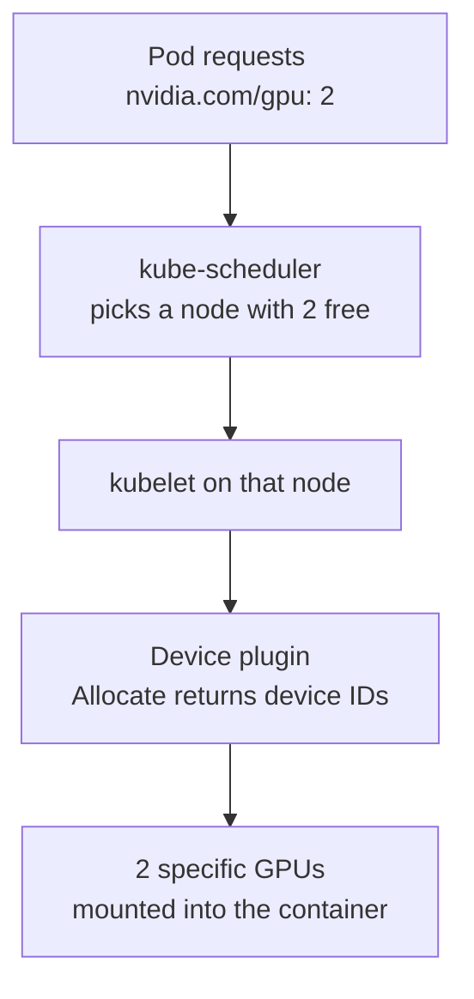
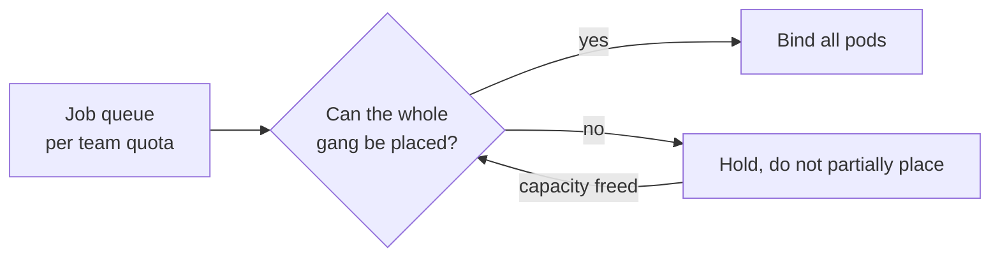
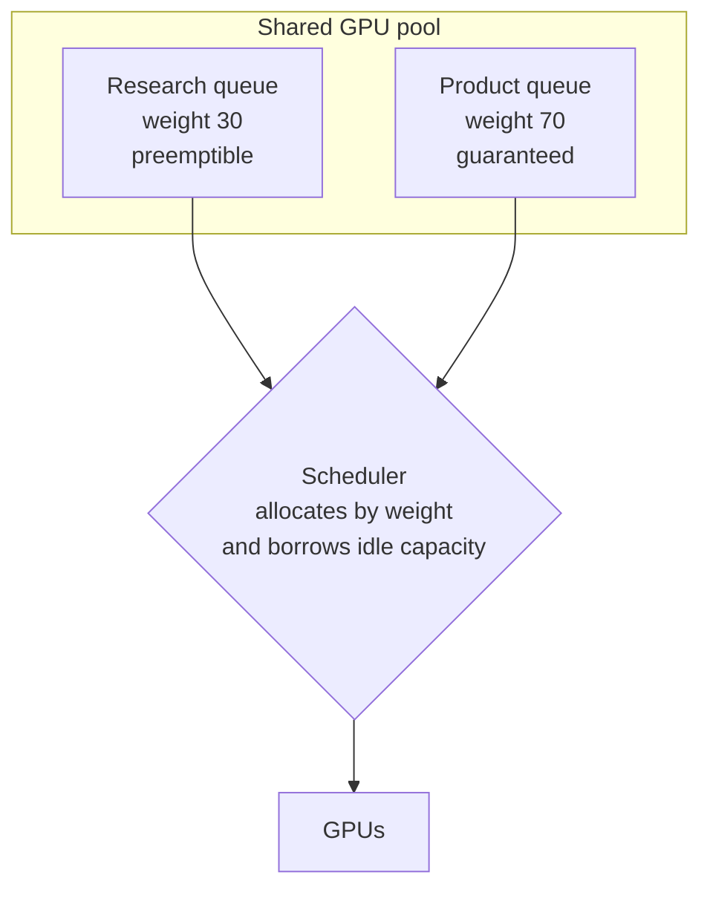
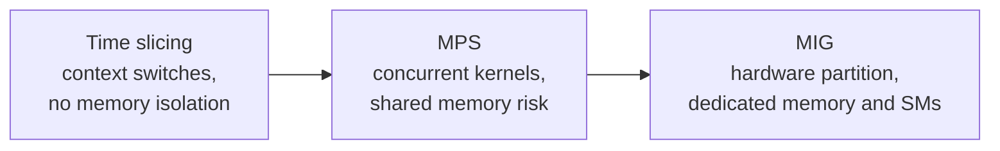

# 02. Cluster Scheduling and Fair Sharing

How a GPU gets from "a pod asks for one" to "a physical device is assigned."
This is the most NVIDIA-specific pair of questions in the set.

---

## Q3. Design a scheduler for 1000 GPU nodes.

> You run 1000 nodes, 8 GPUs each. Teams submit training and inference jobs.
> How does a GPU get assigned to a pod?

**What they are probing:** whether you know how GPU scheduling actually works in
Kubernetes, or whether you assume the default scheduler understands GPUs. It
does not.

### The mechanism

1. **GPUs are not a normal resource.** They are advertised as an *extended
   resource*, which means integer quantities and request equal to limit. You
   cannot request half a GPU this way.
2. **A device plugin advertises them.** A DaemonSet on each node finds the
   devices and tells the kubelet how many exist.
3. **The kubelet reports the count to the API server.** Now the scheduler sees
   `nvidia.com/gpu: 8` on that node like any other resource.
4. **Allocation is two steps.** The scheduler picks a node with a free unit. Then
   the kubelet asks the device plugin which *specific* device to hand over.

### Where the default scheduler is not enough

| Problem | Why the default fails | What you add |
|---|---|---|
| Distributed training needs 64 pods at once | Schedules per pod, so you get half a job running and half pending | Gang scheduling (coscheduling, Volcano, Kueue) |
| GPUs on the same node should be NVLink-adjacent | Scheduler sees an integer count, not topology | Topology-aware plugin or node labels plus affinity |
| A job needs a specific GPU type or memory size | Labels are free-form and easy to get wrong | Node labels, taints, or a custom scheduler plugin |
| A team must not exceed its quota | Default has no queue concept | Queues with quota and borrowing |
| Idle GPUs waste money | Nothing fills or reclaims them | Backfill and preemption policies |

### The design answer

- **Advertise:** device plugin per node, optionally in MIG mode to expose slices.
- **Place:** weight the scheduler on GPU type, free capacity, topology locality,
  and queue fairness, in that order of hard constraints first.
- **Protect:** gang admission so a distributed job is all-or-nothing, and a
  quota system so one team cannot take the fleet.
- **Reclaim:** preemption for low-priority work so expensive GPUs do not idle.

**Follow-ups**

- Why can gang scheduling deadlock? (Two jobs each hold half the fleet and each
  waits for the other. You need a reservation or all-or-nothing admission.)
- Where does MIG fit? (The device plugin advertises each slice as its own
  resource name, so the scheduler places slices, not GPUs.)
- How do you handle a job that needs 8 GPUs on one node versus 8 across nodes?
  (One is a single-node constraint; the other needs a fabric that can carry the
  collectives. Same count, different placement rule.)

---

## Q4. Two teams share a GPU pool and one starves the other.

> A research team runs week-long jobs. A product team runs five-minute inference
> tasks. The product team's latency is now terrible. Fix it without buying GPUs.

**What they are probing:** fairness, preemption, and the difference between hard
and soft isolation. Also whether you reach for a scheduler change when the real
answer might be a queue.

### The reasoning

1. **This is a queueing problem before it is a scheduling problem.** Two very
   different service-time distributions sharing one pool will always punish the
   short jobs, because a long job holds the resource for a long time.
2. **Separate the pools, or separate the priorities.** Either reserve capacity,
   or make the long jobs preemptible.
3. **Isolation strength is a dial**, and you should name where you are setting it.

### Isolation options, weakest to strongest

1. **Time slicing** is the default and the weakest. Tenants take turns, and a
   noisy neighbor costs you latency with no accounting.
2. **MPS** lets kernels from several processes run concurrently. Better
   throughput, weaker fault isolation.
3. **MIG** is a real hardware split with its own memory and SMs. Strongest
   isolation, but you must pick a fixed partition shape up front.

### The answer you want to give

"I would split by queue first, not by scheduler trickery. Give the product team
a guaranteed reservation with a high weight, and let research borrow idle
capacity at a lower priority so it is preemptible. For the latency-sensitive
tier I would use MIG or at least dedicated time slices so a long job cannot
degrade them. Then I would add metering so the borrowing is visible and the
conversation about capacity is based on numbers."

**Follow-ups**

- Why is time slicing bad for latency-sensitive work? (A context switch stalls
  you behind a kernel you do not control; you cannot bound the tail.)
- When is MIG the wrong choice? (Small jobs that cannot fill a slice, and
  workloads that need the whole GPU's memory. You pay for idle capacity.)
- How do you prevent starvation of the low-priority team? (Aging or a minimum
  guaranteed share, so borrowing is bounded in time.)
