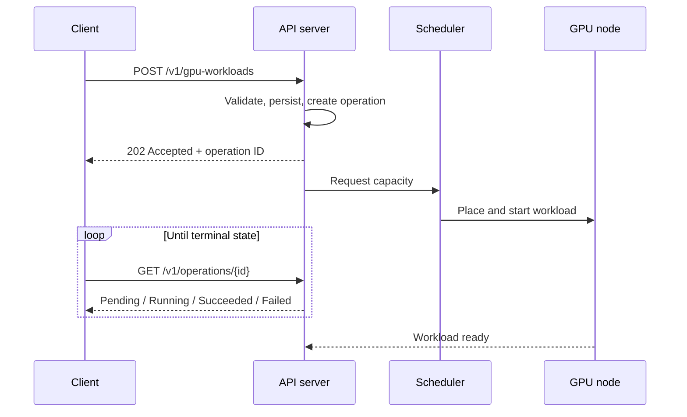
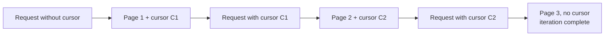
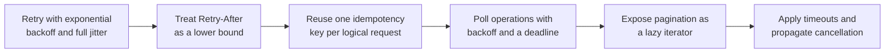

# 3. Control Plane, API Design, and Failure Handling

## 3.1 Asynchronous operations

Provisioning takes minutes: node scale-up, image pull, model download, device
initialization. A synchronous create times out before the resource exists.

Split the request from the result. The API accepts the request, returns
immediately, and exposes an operation to poll.



## 3.2 Resources and methods

| Method | Path | Semantics |
|---|---|---|
| `POST` | `/v1/gpu-workloads` | Create; returns `202` and an operation |
| `GET` | `/v1/gpu-workloads` | List, paginated |
| `GET` | `/v1/gpu-workloads/{id}` | Read status |
| `PATCH` | `/v1/gpu-workloads/{id}` | Modify mutable fields |
| `DELETE` | `/v1/gpu-workloads/{id}` | Request deletion; returns `202` |
| `GET` | `/v1/operations/{id}` | Read operation status |
| `GET` | `/v1/gpu-types` | Enumerate device types and capacities |

Deletion is asynchronous, since cancelling a workload means draining and releasing
the device. Operations are durable, so a client that dies between the create call
and the first poll recovers by listing. That durability makes the operation a
first-class resource with its own lifetime.

## 3.3 Idempotency

A `POST` retried after a timeout may already have succeeded. A naive retry then
creates a second workload consuming capacity nobody requested.

```mermaid
sequenceDiagram
    participant C as Client
    participant A as API server

    C->>A: POST /v1/gpu-workloads<br/>Idempotency-Key: K
    A->>A: Key K unseen; process the request
    A-->>C: 202 + operation O1
    Note over C,A: Connection drops; client does not know the outcome
    C->>A: POST /v1/gpu-workloads<br/>Idempotency-Key: K (retry)
    A->>A: Key K seen; do not create again
    A-->>C: 202 + operation O1 (same operation)
```

Generate the key once per logical request and reuse it across retries. Retain the
key and its original response for at least the maximum client retry window. Give
the same key with a different body a conflict response. Scope keys to a tenant.

This pays off when the client library generates and reuses keys automatically.

## 3.4 Pagination

Cursor pagination. Offsets are unstable under concurrent modification: an insert
or delete between two requests shifts the window, and records get skipped or
duplicated.

A cursor encodes a position in the ordered result set. Iteration ends when the
response carries no cursor. A page can come back empty while results remain, so
treating an empty page as the end of the list loses data.



Keep cursors opaque. Handing the client the internal ordering key turns any change
to the sort order into a breaking change.

## 3.5 Error taxonomy

| Status | Meaning | Client action |
|---|---|---|
| `400` | Validation failure | Correct the request |
| `401`, `403` | Authentication or authorization failure | Refresh credentials |
| `404` | Resource absent | Stop |
| `409` | Conflict, such as an idempotency key mismatch | Stop |
| `429` | Rate limited | Retry after `Retry-After` |
| `500`, `503` | Server-side failure | Retry with backoff |

Send `Retry-After` with a `429`, and the client treats it as a lower bound.

## 3.6 Versioning

Put the major version in the path, so breaking changes ship under a new version
while existing clients keep working. Pin the major version in the client library,
so an SDK upgrade leaves the wire contract alone.

## 3.7 Client library responsibilities

The API cannot enforce retry behavior, since only the client knows the context of
a failed call. An SDK that omits the following makes every customer implement it
differently.



### Retry policy

Exponential backoff, a cap, and full jitter. Full jitter draws the delay uniformly
from zero to the capped backoff. Without it, thousands of clients that fail at the
same moment retry in step and rebuild the load that caused the failure.

`Retry-After` is a lower bound. Retrying sooner spends capacity the server has
told you it does not have. Retrying later burns the client's own time budget.

### Thread safety

Make the client cloneable and shareable across threads. A cheap handle over shared
state, such as a reference-counted inner struct, gives you both. Bound the
connection pool and return connections on completion, so a high-concurrency caller
runs out of work before it runs out of file descriptors.

## 3.8 Failure handling

### Device failure

| Symptom | Usual cause | Response |
|---|---|---|
| Stops responding | Hardware fault, removed from the bus | Drain the node |
| Correctable errors rising | Degrading hardware | Warn and plan replacement |
| Uncorrectable error | Memory fault | Remove the device |
| Degraded interconnect | Link or topology problem | No error raised; throughput falls |

A degraded link raises no error. It produces a slow workload, which gets
investigated as a performance problem until someone checks the interconnect.

### Node drain

A failed device makes the node suspect as well as the pod. Draining keeps new work
off a machine whose PCIe path or power delivery is in question.


### Blast radius

Lost work dominates the cost of a failure. Restarting a pod takes seconds. Redoing
six hours of training does not.

The checkpoint interval sets how much computation is discarded, and the checkpoint
location decides whether the data survives the node, so keep copies elsewhere.
Per-rank restart decides whether one failed rank restarts the job or only itself.
Admission control decides what happens to the queue as capacity drops.

| Level | Action |
|---|---|
| Device | Classify the fault; withdraw unreliable devices |
| Node | Taint and drain; reschedule elsewhere |
| Workload | Restart from the most recent valid checkpoint |
| Fleet | Match admitted work to available capacity |
