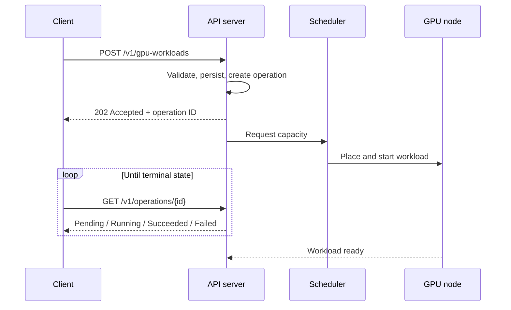
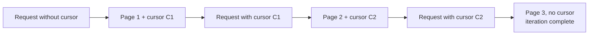
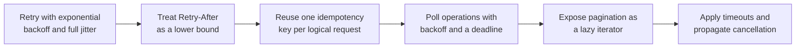

# 3. Control Plane, API Design, and Failure Handling

## 3.1 Asynchronous operation model

Provisioning a GPU workload takes time. A single request can set off node
scale-up, image pull, model download, and device initialization before the
workload starts running. You are looking at minutes, which rules out a synchronous
create: the HTTP request times out long before the resource exists.

The usual answer treats the request and the result as two resources. The API
accepts the request, returns immediately, and exposes an operation for the client
to poll.



## 3.2 Resource and method design

| Method | Path | Semantics |
|---|---|---|
| `POST` | `/v1/gpu-workloads` | Create a workload; returns `202` and an operation |
| `GET` | `/v1/gpu-workloads` | List workloads, paginated |
| `GET` | `/v1/gpu-workloads/{id}` | Read a workload and its current status |
| `PATCH` | `/v1/gpu-workloads/{id}` | Modify mutable fields such as the replica count |
| `DELETE` | `/v1/gpu-workloads/{id}` | Request deletion; returns `202` |
| `GET` | `/v1/operations/{id}` | Read operation status |
| `GET` | `/v1/gpu-types` | Enumerate the available device types and capacities |

Deletion is asynchronous, because cancelling a running workload means draining
and releasing the device. `DELETE` therefore returns `202`, and the operation
reports completion. Operations are durable, so a client that dies between the
create call and the first poll recovers by listing operations. That durability is
what makes the operation a first-class resource, with a lifetime of its own.

## 3.3 Idempotency

A `POST` retried after a timeout may already have succeeded. Retry it naively and
you get a second workload consuming GPU capacity that nobody asked for.

The mechanism is a client-supplied idempotency key.

```mermaid
sequenceDiagram
    participant C as Client
    participant A as API server

    C->>A: POST /v1/gpu-workloads<br/>Idempotency-Key: K
    A->>A: Key K unseen; process the request
    A-->>C: 202 + operation O1
    Note over C,A: Connection drops; client does not know the outcome
    C->>A: POST /v1/gpu-workloads<br/>Idempotency-Key: K (retry)
    A->>A: Key K seen; do not create again
    A-->>C: 202 + operation O1 (same operation)
```

Generate the key once for each logical request, and reuse it across every retry.
Regenerating it per attempt defeats the whole mechanism. Retain the key and its
original response for at least as long as a client may keep retrying. Give two
requests that carry the same key and different bodies a conflict response, since
you cannot tell what the client intended. Scope the key to a tenant so one tenant
can leave another's keys alone.

This is a server-side requirement that pays off only when the client library
generates and reuses keys automatically. Idempotency the customer implements by
hand gets implemented inconsistently.

## 3.4 Pagination

List endpoints use cursor pagination. Offsets are unstable under concurrent
modification: an insert or delete between two requests shifts the window, and
records get skipped or returned twice.

A cursor encodes a position in the ordered result set. Iteration ends when the
response carries no cursor. A page can come back empty while results remain, so
treating an empty page as the end of the list loses data.



Keep cursors opaque. Handing the client the internal ordering key turns any
change to the sort order into a breaking change.

## 3.5 Error taxonomy

The status code tells the client whether to retry, and the client needs that
answer to behave correctly.

| Status | Meaning | Client action |
|---|---|---|
| `400` | Validation failure | Do not retry; correct the request |
| `401`, `403` | Authentication or authorization failure | Do not retry; refresh credentials |
| `404` | Resource absent | Do not retry |
| `409` | Conflict, such as an idempotency key mismatch | Do not retry |
| `429` | Rate limited | Retry after the interval in `Retry-After` |
| `500`, `503` | Server-side failure | Retry with backoff |

Send `Retry-After` with a `429`, and the client treats it as a lower bound on the
delay.

## 3.6 Versioning

Put the major version in the path. Breaking changes then ship under a new version
while existing clients keep working. Pin the major version in the client library,
so an SDK upgrade never changes the wire contract without you deciding to change
it.

## 3.7 Client library responsibilities

The API cannot enforce correct retry behavior, because only the client knows the
context of a failed call. An SDK that omits the following leaves every customer to
implement it, and they will each do it differently.



### Retry policy

Retry with exponential backoff, a cap, and full jitter. Full jitter draws the
delay uniformly from zero to the capped backoff. Without it, thousands of clients
that fail at the same moment retry in step and rebuild the load that caused the
failure.

Treat `Retry-After` from the server as a lower bound. Retrying sooner spends
capacity the server has told you it does not have, and retrying later burns the
client's own time budget.

### Thread safety and connection reuse

Make the client cloneable and safe to share across threads. A cheap handle over
shared state, such as a reference-counted inner struct, gives you both. Bound the
connection pool and return connections on completion, so a high-concurrency
caller runs out of work before it runs out of file descriptors.

## 3.8 Failure handling

### Device failure

| Symptom | Usual cause | Response |
|---|---|---|
| Device stops responding | Hardware fault, device removed from the bus | Drain the node and remove it from service |
| Correctable errors at a rising rate | Degrading hardware | Treat as a warning and plan replacement |
| Uncorrectable error | Memory fault | Remove the device from service |
| Degraded interconnect | Link or topology problem | No error is raised; throughput falls |

The last row catches people out. A degraded link raises no error. It produces a
workload that runs slowly, and it gets investigated as a performance problem
until someone thinks to look at the interconnect.

### Node drain

A failed device makes the node suspect as well as the pod. Draining stops the
scheduler from placing new work on a machine whose PCIe path or power delivery is
in question.


### Blast radius

Lost work dominates the cost of a failure. Restarting a pod takes seconds;
redoing six hours of training does not.

The checkpoint interval sets how much computation you discard. The location of
checkpoints decides whether they survive the failure of the node, so keep copies
somewhere else. Whether one failed rank restarts the whole job or only itself sets
the scale of the interruption, and elastic training lets a job continue at reduced
size. Admission control decides what happens to the queue as capacity drops, so
hold work that cannot be placed and watch the queue depth.

| Level | Action |
|---|---|
| Device | Classify the fault, and withdraw the device if it is unreliable |
| Node | Taint and drain, and reschedule work elsewhere |
| Workload | Restart from the most recent valid checkpoint |
| Fleet | Match admitted work to available capacity |
