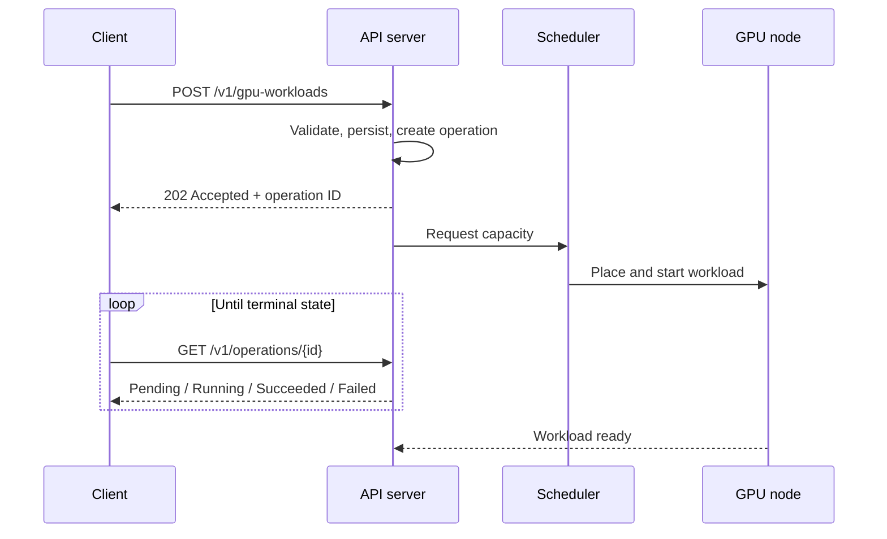
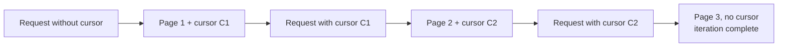
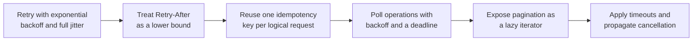

# 3. Control Plane, API Design, and Failure Handling

This section covers how workloads are submitted and tracked, why the API is
asynchronous, what the client library must do, and how the system responds to
hardware failure.

## 3.1 Asynchronous operation model

Provisioning a GPU workload takes time. A request can trigger node scale-up,
image pull, model download, and device initialization before the workload starts.
That is minutes, which makes a synchronous create unusable: the HTTP request
would time out first.

The usual solution treats the request and the result as separate resources. The
API accepts the request, returns immediately, and exposes an operation the client
polls.



## 3.2 Resource and method design

| Method | Path | Semantics |
|---|---|---|
| `POST` | `/v1/gpu-workloads` | Create a workload; returns `202` and an operation |
| `GET` | `/v1/gpu-workloads` | List workloads, paginated |
| `GET` | `/v1/gpu-workloads/{id}` | Read a workload and its current status |
| `PATCH` | `/v1/gpu-workloads/{id}` | Modify mutable fields such as the replica count |
| `DELETE` | `/v1/gpu-workloads/{id}` | Request deletion; returns `202` |
| `GET` | `/v1/operations/{id}` | Read operation status |
| `GET` | `/v1/gpu-types` | Enumerate the available device types and capacities |

Two conventions need stating. Deletion is asynchronous, because cancelling a
running workload means draining and releasing the device. `DELETE` therefore
returns `202`, and the operation reports completion. The operation is also
durable: a client that fails between the create call and the first poll can
recover by listing operations. That is why the operation is a first-class
resource rather than a field on the workload.

## 3.3 Idempotency

A `POST` retried after a timeout may already have succeeded. Without protection,
the retry creates a second workload that consumes GPU capacity.

The mechanism is a client-supplied idempotency key.

```mermaid
sequenceDiagram
    participant C as Client
    participant A as API server

    C->>A: POST /v1/gpu-workloads<br/>Idempotency-Key: K
    A->>A: Key K unseen; process the request
    A-->>C: 202 + operation O1
    Note over C,A: Connection drops; client does not know the outcome
    C->>A: POST /v1/gpu-workloads<br/>Idempotency-Key: K (retry)
    A->>A: Key K seen; do not create again
    A-->>C: 202 + operation O1 (same operation)
```

Requirements for the key:

- Generate it once per logical request and reuse it across retries. Do not
  regenerate it for each attempt.
- Retain it with the original response for at least the maximum client retry
  window.
- Reject two requests carrying the same key with different bodies as a conflict,
  since the client's intent is ambiguous.
- Scope keys to a tenant so one tenant cannot affect another.

This is a server-side requirement, but it only helps if the client library
generates and reuses keys automatically. Idempotency the customer implements by
hand will be implemented inconsistently.

## 3.4 Pagination

List endpoints use cursor pagination. Offsets are unstable under concurrent
modification: an insert or delete between two requests shifts the window and
causes records to be skipped or returned twice.

A cursor encodes a position in the ordered result set. Iteration ends when the
response carries no cursor, rather than when a page comes back empty, because a
page can be empty with results still remaining.



Cursors should be opaque. Exposing the internal ordering key makes any change to
the sort order a breaking change.

## 3.5 Error taxonomy

Responses must distinguish retryable from non-retryable conditions, because the
correct client behavior differs between them.

| Status | Meaning | Client action |
|---|---|---|
| `400` | Validation failure | Do not retry; correct the request |
| `401`, `403` | Authentication or authorization failure | Do not retry; refresh credentials |
| `404` | Resource absent | Do not retry |
| `409` | Conflict, such as an idempotency key mismatch | Do not retry |
| `429` | Rate limited | Retry after the interval in `Retry-After` |
| `500`, `503` | Server-side failure | Retry with backoff |

A `429` response should carry `Retry-After`, and the client should treat it as a
lower bound on the delay.

## 3.6 Versioning

Including the major version in the path lets breaking changes ship under a new
version while existing clients keep working. The client library should pin the
major version it was built against, so an SDK upgrade does not change the wire
contract by accident.

## 3.7 Client library responsibilities

The API cannot enforce correct retry behavior, because only the client knows the
context of a failed call. A usable SDK therefore handles the following.



### Retry policy

Retries should use exponential backoff with a cap, and full jitter. Full jitter
draws the delay uniformly from zero to the capped backoff, rather than using the
capped value directly. Without jitter, many clients failing at once retry in step
and reproduce the load that caused the failure.

`Retry-After` from the server is a lower bound. Retrying sooner violates the
server's stated capacity. Retrying later wastes the client's own time budget.

### Thread safety and connection reuse

A client should be cloneable and safe to share across threads. This is usually a
cheap handle over shared state, such as a reference-counted inner struct.
Connection pools should be bounded, and connections returned on completion, so
that a high-concurrency caller does not exhaust file descriptors.

## 3.8 Failure handling

### Device failure

A device can fail in several ways, and the response differs between them.

| Symptom | Usual cause | Response |
|---|---|---|
| Device stops responding | Hardware fault, device removed from the bus | Drain the node and remove it from service |
| Correctable errors at a rising rate | Degrading hardware | Treat as a warning and plan replacement |
| Uncorrectable error | Memory fault | Remove the device from service |
| Degraded interconnect | Link or topology problem | No error is raised; throughput falls |

The last case is easily missed. A degraded link raises no error. It produces a
workload that runs more slowly, and it gets investigated as a performance problem
until someone checks the interconnect.

### Node drain

A failed device makes the node suspect as well as the pod. Draining stops the
scheduler from placing new work on a machine whose PCIe path or power delivery is
in question.


### Blast radius

The cost of a failure is dominated by lost work rather than by restart time. Four
decisions set that cost.

The checkpoint interval sets how much computation is discarded. The location of
checkpoints determines whether they survive the node failure, so they cannot live
only on that node. Whether one failed rank restarts the whole job or only itself
sets the scale of the interruption, and elastic training lets a job continue at
reduced size. Admission control sets cluster behavior as capacity falls, so work
that cannot be placed is held rather than queued without bound.

| Level | Action |
|---|---|
| Device | Classify the fault, and withdraw the device if it is unreliable |
| Node | Taint and drain, and do not reschedule onto a suspect node |
| Workload | Restart from the most recent valid checkpoint |
| Fleet | Reduce admitted work to match available capacity |
