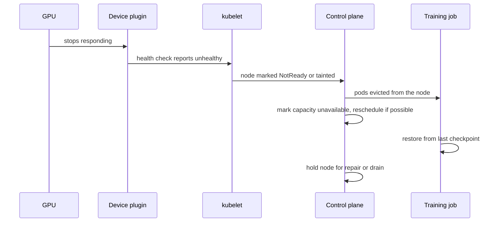
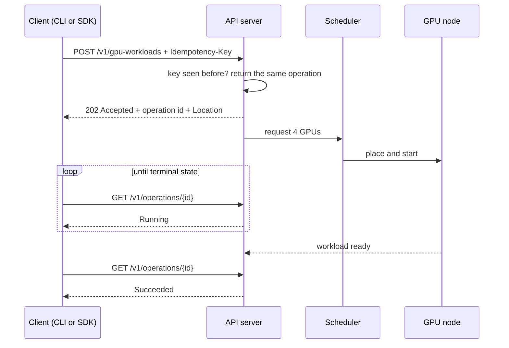
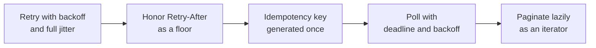

# 03. Control Plane and Failure Handling

The API surface that customers use, and what happens when hardware misbehaves.
These two questions map directly onto the JD's "design SDKs and CLIs" and
"highly available microservices" lines.

---

## Q5. A GPU falls off the bus mid-job.

> During a 40-hour training run, a GPU stops responding. Walk me through what
> happens, from detection to recovery.

**What they are probing:** whether you can reason about blast radius and
recovery cost, and whether you understand that a GPU failure is not the same
kind of event as a pod dying.

### The reasoning

1. **Detection is layered.** The device plugin health check, hardware error
   counters, and a node problem detector each see a different symptom.
2. **A bad GPU makes the node unhealthy, not just the pod.** You cannot trust
   the rest of the node until you drain it, because the problem may be the
   PCIe path, the NVLink island, or power.
3. **The expensive part is lost work,** not the restart. Forty hours of training
   with no checkpoint is gone.

### The layers of the answer

| Layer | What you do |
|---|---|
| Device | Classify the error. A correctable ECC error is a warning. A double-bit error or an unrecoverable fault needs the GPU out of service. |
| Node | Taint and drain. Do not let new pods land on a node with an unhealthy GPU. |
| Job | Restart from the last checkpoint. For distributed jobs, decide whether one bad rank restarts the whole job or just that rank. |
| Fleet | If capacity drops, your scheduler should stop admitting work that cannot fit instead of queueing forever. |

### The part most people miss

**A GPU failure can be a fabric failure.** If the link between GPUs degrades
instead of disappearing, nothing crashes. The job just gets slower, and it looks
like a workload problem until someone checks the interconnect. That is why the
debugging question in file 05 matters.

**Follow-ups**

- Why not just restart the pod in place? (The node is suspect. You would be
  restarting onto the same broken device, and the next failure costs you the
  same work again.)
- How do you make recovery cheap? (Frequent checkpoints, and checkpoint to
  storage that is not on the failing node.)
- Does the whole job die if one rank fails? (Only if you designed it that way.
  Elastic training and per-rank restart bound the blast radius.)

---

## Q6. Design the API to launch a GPU workload.

> Customers need to launch a GPU job and watch it run. Design the API they call,
> and the SDK and CLI that sit on top of it.

**What they are probing:** the core of the role. Resource modeling, asynchronous
operations, idempotency, and error taxonomy. This is where "SDK and CLI" stops
being a bullet and becomes code.

### The reasoning

1. **Provisioning is slow,** so the API must be asynchronous. Node scale-up,
   image pull, and GPU initialization take minutes. A synchronous create would
   time out.
2. **A retried create must not create two workloads.** That is what an
   idempotency key is for, and it belongs in the design from the start.
3. **The client is the product.** Retries, pagination, and polling are the SDK's
   job, so customers do not hand-roll them badly.

### The surface

| Concern | Design |
|---|---|
| Create | `POST /v1/gpu-workloads` returns `202` plus an operation resource |
| Idempotency | `Idempotency-Key` header, server replays the original response |
| Poll | `GET /v1/operations/{id}`, terminal states are succeeded, failed, cancelled |
| List | Cursor pagination, opaque token, stop when the cursor is absent |
| Cancel | `DELETE` returns `202`, cancellation is itself asynchronous |
| Errors | `400` validation, `409` conflict, `429` with `Retry-After`, `503` retryable |

### What the SDK must do, because the API cannot

Each of those is a place where a naive client turns a transient error into a
customer-visible outage or a duplicate job. That is the entire argument for
shipping an SDK instead of only a REST API.

### Versioning

Put the version in the path so you can introduce breaking changes without
breaking existing clients. The client library should pin the major version.

**Follow-ups**

- Why `202` and not `201`? (`201` means created and ready. You have not created
  the resource yet; you accepted a request to create it.)
- What happens if the client dies between create and poll? (The operation keeps
  running server-side, and the client finds it by listing. This is why the
  operation is a first-class resource.)
- How does the CLI fit? Same SDK, plus argument parsing, output modes, and exit
  codes. Precedence should be flag, then environment, then config file, then
  default, and an empty environment variable is unset, not configured.
