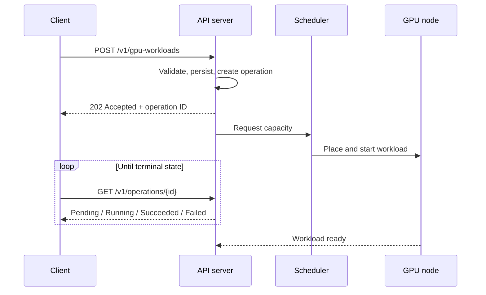
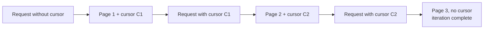
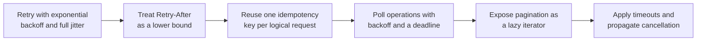

# 3. Control Plane, API Design, and Failure Handling

This section covers the customer-facing surface of a GPU cloud service: the way
workloads are submitted and tracked, the reasons the API is asynchronous, the
responsibilities of the client library, and the response to hardware failure.

## 3.1 Asynchronous operation model

Provisioning a GPU workload takes time. A request may cause node scale-up, image
pull, model download, and device initialization before the workload begins to
run. Latency in the minutes range makes a synchronous create operation
unworkable, because the HTTP request would time out well before the resource
exists.

The conventional solution is to treat the request and the result as separate
resources. The API accepts the request, returns immediately, and exposes an
operation resource that the client polls.



## 3.2 Resource and method design

| Method | Path | Semantics |
|---|---|---|
| `POST` | `/v1/gpu-workloads` | Create a workload; returns `202` and an operation |
| `GET` | `/v1/gpu-workloads` | List workloads, paginated |
| `GET` | `/v1/gpu-workloads/{id}` | Read a workload and its current status |
| `PATCH` | `/v1/gpu-workloads/{id}` | Modify mutable fields such as the replica count |
| `DELETE` | `/v1/gpu-workloads/{id}` | Request deletion; returns `202` |
| `GET` | `/v1/operations/{id}` | Read operation status |
| `GET` | `/v1/gpu-types` | Enumerate the available device types and capacities |

Two conventions are worth stating explicitly. Deletion is asynchronous, because
cancelling a running workload requires draining and releasing the device, so
`DELETE` returns `202` and the operation resource reports completion. The
operation is also durable: a client that fails between the create call and the
first poll can recover by listing operations. This is the reason the operation is
a first-class resource rather than a status field embedded in the workload.

## 3.3 Idempotency

A `POST` that is retried after a timeout may already have succeeded. Without
protection, the retry creates a second workload, and that workload consumes GPU
capacity in addition to the first.

The mechanism used to prevent this is a client-supplied idempotency key.

```mermaid
sequenceDiagram
    participant C as Client
    participant A as API server

    C->>A: POST /v1/gpu-workloads<br/>Idempotency-Key: K
    A->>A: Key K unseen; process the request
    A-->>C: 202 + operation O1
    Note over C,A: Connection drops; client does not know the outcome
    C->>A: POST /v1/gpu-workloads<br/>Idempotency-Key: K (retry)
    A->>A: Key K seen; do not create again
    A-->>C: 202 + operation O1 (same operation)
```

The requirements for the key are as follows. It has to be generated once for each
logical request and reused across retries, rather than regenerated for each
attempt. The server has to retain the key together with the original response for
a period at least as long as the maximum client retry window. Two requests that
carry the same key but different bodies should be rejected as a conflict, since
the intent of the client is ambiguous in that case. Keys have to be scoped to a
tenant so that one tenant cannot interfere with another.

This is a server-side requirement, but it produces the intended benefit only if
the client library generates and reuses keys automatically. Idempotency that the
customer has to implement manually is idempotency that will be implemented
inconsistently.

## 3.4 Pagination

List endpoints use cursor pagination rather than offset pagination. Offsets are
unstable under concurrent modification, since an insertion or deletion between
two requests shifts the result window and causes records to be skipped or
returned twice.

A cursor encodes a position in the ordered result set. The termination condition
is the absence of a cursor in the response, rather than an empty page, because a
page may legitimately be empty while further results remain.



Cursors should be opaque to the client. Exposing the internal ordering key would
make any change to the sort order a breaking change.

## 3.5 Error taxonomy

Responses have to distinguish retryable from non-retryable conditions, because
the correct client behavior differs between them.

| Status | Meaning | Client action |
|---|---|---|
| `400` | Validation failure | Do not retry; correct the request |
| `401`, `403` | Authentication or authorization failure | Do not retry; refresh credentials |
| `404` | Resource absent | Do not retry |
| `409` | Conflict, such as an idempotency key mismatch | Do not retry |
| `429` | Rate limited | Retry after the interval given in `Retry-After` |
| `500`, `503` | Server-side failure | Retry with backoff |

A `429` response should carry `Retry-After`, and the client should treat that
value as a lower bound on the delay.

## 3.6 Versioning

Including the major version in the path allows breaking changes to be introduced
under a new version while existing clients continue to function. The client
library should pin the major version against which it was built, so that an SDK
upgrade does not alter the wire contract without an explicit decision to do so.

## 3.7 Client library responsibilities

The API cannot enforce correct retry behavior, since only the client knows the
context of a failed call. A usable SDK therefore takes on the following
responsibilities, so that customers do not implement them inconsistently.



### Retry policy

Retries should use exponential backoff with a cap and full jitter, in which the
delay is drawn uniformly from the interval between zero and the capped backoff
rather than set to the capped value. Without jitter, a large population of
clients that fail at the same time will retry in step and reproduce the load that
caused the failure.

The `Retry-After` value supplied by the server is a lower bound on the delay
rather than a target. Retrying sooner violates the server's stated capacity, and
retrying later than necessary wastes the client's own time budget.

### Thread safety and connection reuse

A client should be cloneable and safe to share between threads, which is usually
implemented as a cheap handle over shared state, for example a reference-counted
inner structure. Connection pools should be bounded, and connections should be
returned on completion, so that a caller with high concurrency does not exhaust
file descriptors.

## 3.8 Failure handling

### Device failure

A device can fail in several ways, and the appropriate response differs between
them.

| Symptom | Usual cause | Response |
|---|---|---|
| Device stops responding | Hardware fault, device removed from the bus | Drain the node and remove it from service |
| Correctable errors at a rising rate | Degrading hardware | Treat as a warning and plan replacement |
| Uncorrectable error | Memory fault | Remove the device from service |
| Degraded interconnect | Link or topology problem | No error is raised; throughput is reduced |

The final case is the one most often overlooked. A degraded link does not produce
an error condition. It produces a workload that runs more slowly, and it is
typically investigated as a performance problem until the interconnect is
examined.

### Node drain

A failed device makes the node suspect as well as the pod. Draining the node
prevents the scheduler from placing new work on a machine whose PCIe path or
power delivery is in question.


### Blast radius

The cost of a failure is dominated by lost work rather than by restart time. The
design decisions that determine that cost are the following.

The checkpoint interval determines how much computation is discarded. The
location of checkpoints determines whether they survive the failure of the node,
so they cannot reside only on that node. Whether a single failed rank restarts
the whole job or only itself determines the scale of the interruption, and
elastic training allows a job to continue at reduced size. Finally, admission
control determines the behavior of the cluster when capacity falls, so that work
that cannot be placed is held rather than queued without bound.

| Level | Action |
|---|---|
| Device | Classify the fault and withdraw the device if it is unreliable |
| Node | Taint and drain, and do not reschedule onto a suspect node |
| Workload | Restart from the most recent valid checkpoint |
| Fleet | Reduce admitted work to match available capacity |
