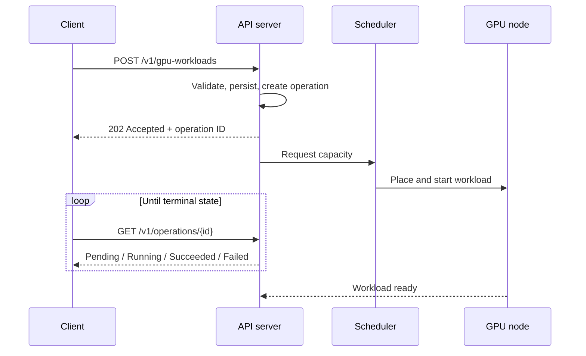
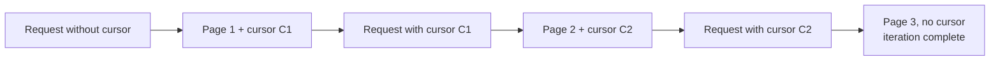
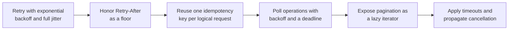
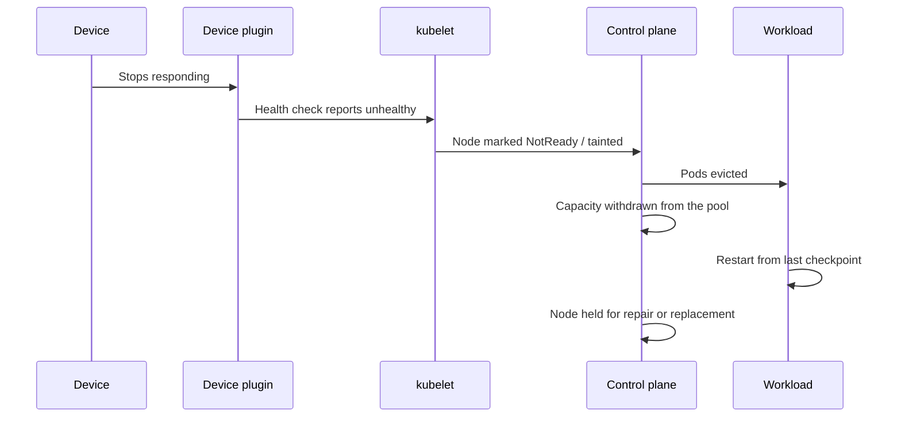

# 3. Control Plane, API Design, and Failure Handling

This section covers the customer-facing surface of a GPU cloud: how workloads are
submitted and tracked, why the API must be asynchronous, what the client library
is responsible for, and how the system responds to hardware failure.

## 3.1 Why the API is asynchronous

Provisioning a GPU workload is slow. The request may trigger node scale-up, image
pull, model download, and device initialization before the workload is running.
Latency in the minutes range makes a synchronous create operation unusable: the
HTTP request would time out long before the resource exists.

The standard solution is to treat the *request* and the *result* as separate
resources. The API accepts the request, returns immediately, and exposes an
operation that the client polls.



## 3.2 Resource and method design

| Method | Path | Semantics |
|---|---|---|
| `POST` | `/v1/gpu-workloads` | Create a workload; returns `202` and an operation |
| `GET` | `/v1/gpu-workloads` | List workloads, paginated |
| `GET` | `/v1/gpu-workloads/{id}` | Read a workload and its current status |
| `PATCH` | `/v1/gpu-workloads/{id}` | Modify mutable fields such as replica count |
| `DELETE` | `/v1/gpu-workloads/{id}` | Request deletion; returns `202` |
| `GET` | `/v1/operations/{id}` | Read operation status |
| `GET` | `/v1/gpu-types` | Enumerate available device types and capacities |

Two conventions are worth stating explicitly:

- **Deletion is asynchronous.** Cancelling a running workload requires draining
  and releasing the device, so `DELETE` returns `202` and the operation resource
  reports completion.
- **The operation is durable.** A client that crashes between create and poll can
  recover by listing operations. This is the reason the operation is a
  first-class resource rather than an inline status field.

## 3.3 Idempotency

A `POST` that is retried after a timeout may have already succeeded. Without
protection, the retry creates a duplicate workload, and the duplicate consumes
GPU capacity.

The mechanism is a client-supplied idempotency key:

```mermaid
sequenceDiagram
    participant C as Client
    participant A as API server

    C->>A: POST /v1/gpu-workloads<br/>Idempotency-Key: K
    A->>A: Key K unseen; process the request
    A-->>C: 202 + operation O1
    Note over C,A: Connection drops; client does not know the outcome
    C->>A: POST /v1/gpu-workloads<br/>Idempotency-Key: K (retry)
    A->>A: Key K seen; do not create again
    A-->>C: 202 + operation O1 (same operation)
```

Design requirements for the key:

- The key must be generated once per logical request and reused across retries,
  not regenerated per attempt.
- The server must store the key with the original response for a retention window
  at least as long as the maximum client retry window.
- Two requests with the same key but different bodies should be rejected as a
  conflict, since the client's intent is ambiguous.
- Keys must be scoped to a tenant, so one tenant cannot interfere with another.

This is a server-side requirement, but the value is only realized if the client
library generates and reuses keys automatically. Idempotency that the customer
must implement manually is idempotency that will be implemented incorrectly.

## 3.4 Pagination

List endpoints use cursor pagination rather than offset pagination. Offsets are
unstable under concurrent modification: an insertion or deletion between two
requests shifts the result window and causes rows to be skipped or duplicated.

A cursor encodes the position in the ordered result set. The termination
condition is the **absence of a cursor in the response**, not an empty page,
because a page can legitimately be empty while more results remain.



Cursors should be opaque to the client. Exposing the internal ordering key makes
changing the sort order a breaking change.

## 3.5 Error taxonomy

Errors must distinguish retryable from non-retryable conditions, because the
client's correct behavior differs.

| Status | Meaning | Client action |
|---|---|---|
| `400` | Validation failure | Do not retry; fix the request |
| `401` / `403` | Authentication or authorization failure | Do not retry; refresh credentials |
| `404` | Resource absent | Do not retry |
| `409` | Conflict, such as an idempotency key mismatch | Do not retry |
| `429` | Rate limited | Retry after `Retry-After` |
| `500` / `503` | Server-side failure | Retry with backoff |

The `429` response should carry `Retry-After`, and the client should treat it as
a floor rather than a suggestion.

## 3.6 Versioning

Including the major version in the path (`/v1/`) allows breaking changes to be
introduced under a new version while existing clients continue to function. The
client library should pin the major version it is built against, so an SDK
upgrade does not silently change the wire contract.

## 3.7 Client library responsibilities

The API cannot enforce correct retry behavior; only the client can. A usable SDK
takes on the following, so that customers do not implement them inconsistently.



### Retry policy

Retries should use exponential backoff with a cap, and full jitter: the delay is
drawn uniformly from `[0, capped_backoff]` rather than applied exactly. Without
jitter, a large client population that fails simultaneously retries in lockstep
and reconstitutes the load that caused the failure.

The server's `Retry-After` value is a lower bound on the delay, not a target.

### Thread safety and connection reuse

A client should be cloneable and safe to share across threads, implemented as a
cheap handle over shared state (a reference-counted inner struct). Connection
pools should be bounded and connections returned on completion, so that a
high-concurrency caller does not exhaust file descriptors.

## 3.8 Failure handling

### Device failure

A GPU can fail in several ways, and the correct response differs.

| Symptom | Typical cause | Response |
|---|---|---|
| Device stops responding | Hardware fault, fell off the bus | Drain the node, remove from service |
| Correctable errors at a rising rate | Degrading hardware | Treat as a warning; plan replacement |
| Uncorrectable error | Memory fault | Remove the device from service |
| Degraded interconnect | Link or topology problem | No crash; throughput regresses |

The last case is the one most often missed. A degraded link does not produce an
error; it produces a slow workload, which is diagnosed as a performance problem
until someone examines the interconnect.

### Node failure and drain

A failed device makes the node suspect, not just the pod. Draining the node
prevents the scheduler from placing new work on a machine whose PCIe path or
power delivery is in question.



### Blast radius

The cost of a failure is dominated by lost work rather than by restart time.
Design decisions that bound this cost:

- **Checkpoint frequency.** Determines how much computation is discarded.
- **Checkpoint location.** Checkpoints must not reside only on the failing node.
- **Per-rank restart.** Whether one failed rank restarts the entire job or only
  itself. Elastic training allows the job to continue with fewer ranks.
- **Admission control.** When capacity drops, the scheduler should stop admitting
  work it cannot place rather than queueing indefinitely.

### Failure handling summary

| Level | Action |
|---|---|
| Device | Classify the fault; withdraw the device if it is unreliable |
| Node | Taint and drain; do not reschedule onto a suspect node |
| Workload | Restart from the most recent checkpoint |
| Fleet | Reduce admitted work to match available capacity |
