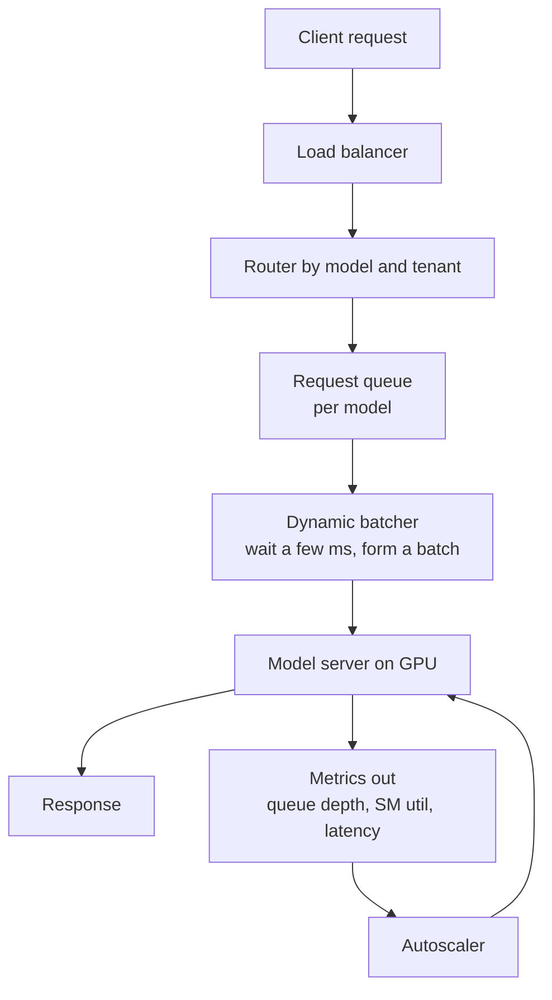
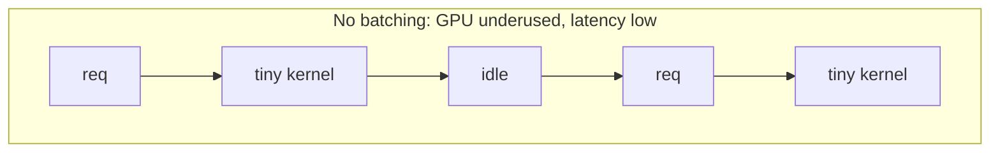
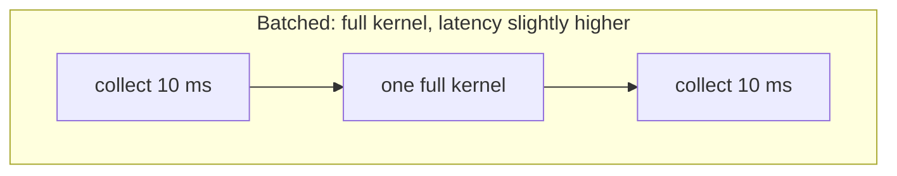
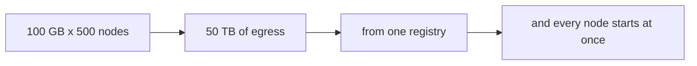
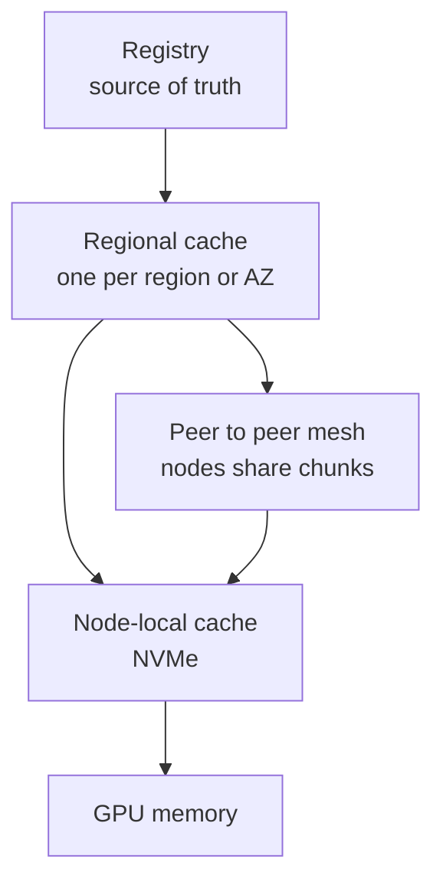

# 04. Serving and Artifact Delivery

The data plane. What happens between a customer request and a tensor on a GPU,
and how the model gets to the machine in the first place.

---

## Q7. Design a multi-tenant inference path.

> Customers send requests to models you host. There are many tenants, and GPUs
> are the expensive part. Design the path from request to response.

**What they are probing:** whether you know that inference serving is a batching
and cold-start problem, not a routing problem, and that you scale on the right
metric.

### The path

### The two decisions that matter

1. **Batching.** A GPU is most efficient on large uniform work. Dynamic batching
   waits a few milliseconds to collect requests into one batch. That trades
   latency for throughput, and the wait window is the tuning knob.

2. **Autoscaling metric.** CPU utilization is meaningless here. Scale on GPU
   utilization and queue depth, or on the SLO you actually promised.

### The cold-start problem

Loading a large model can take tens of seconds to minutes. If you scale to zero,
the first request after idle pays that cost and violates its SLO.

| Technique | What it buys |
|---|---|
| Keep a warm minimum | Bounded latency, some idle cost |
| Pre-pull images and weights on nodes | Removes the download from the critical path |
| Node-local weight cache | Turns a cold load into a memory map |
| Traffic-aware pre-scaling | Scale before the known peak, from history |

### The isolation dimension

Multiple tenants on one GPU need either MIG, MPS, or exclusive devices. Choose
based on whether you need hard memory isolation. A tenant that can exhaust GPU
memory and take down a neighbor is not isolated, it is just co-resident.

**Follow-ups**

- Why is p99 worse than p50 under batching? (Batches form and drain; a request
  that arrives just after a batch closes waits a full cycle.)
- Where does KV cache fit for large language models? (It consumes device memory
  per active sequence, so it sets your concurrency limit and therefore your
  cost per request.)
- How do you route to a model that is not loaded anywhere? (Queue it against a
  loading pod, or reject with a retryable status rather than blocking the LB.)

---

## Q8. Distribute a 100 GB model to 500 nodes.

> A new model version is 100 GB. You have 500 GPU nodes that each need it. The
> registry is a single service in one region. Design the distribution.

**What they are probing:** whether you see the arithmetic before the architecture.
This is a bandwidth question dressed as a deployment question.

### Do the arithmetic first

50 TB through one endpoint is the problem. And if all 500 nodes start together,
they contend for the same bottleneck and the last node finishes far later than
the average. A stampede on your own infrastructure.

### The layered answer

1. **Content-address the artifact.** Reference it by digest, not by tag, so any
   cache can trust it and key on it safely.
2. **Cache in layers.** Regional first, then node-local NVMe. Most requests
   should never reach the registry.
3. **Distribute the final hop peer to peer.** Once a few nodes have a chunk,
   they serve it to their neighbors. This is what turns 50 TB from one source
   into a mesh.
4. **Control the ramp.** Roll out to a wave of nodes, not all 500 at once, or
   you reconstruct the stampede one layer down.
5. **Keep the warm path.** If a node already has last week's model and you only
   changed layers, transfer layers, not the whole artifact.

### What to watch

| Signal | Why it matters |
|---|---|
| Time to first byte of the model | Tells you if the registry is the bottleneck |
| Cache hit rate per layer | Tells you whether layering is actually helping |
| Node start time distribution | The tail is your real deployment time, not the mean |
| Egress cost | The bill scales with nodes, not with model size |

**Follow-ups**

- Why not just bake the model into the image? (Images get big, registries get
  hammered, and you lose the ability to share layers between model versions.)
- What breaks if the node-local cache is not refcounted? (You evict a model a
  running pod is still using. Cache eviction must respect live references.)
- How do you verify integrity? (Content addressing gives you the hash for free.)
