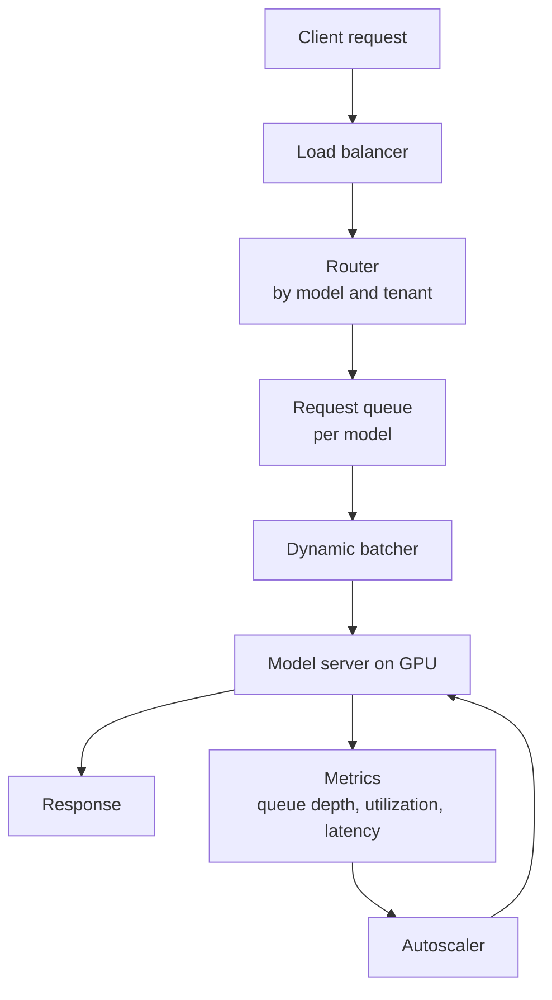
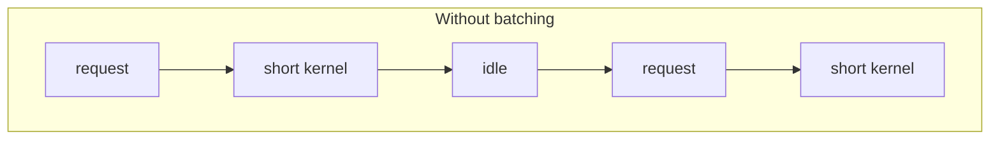
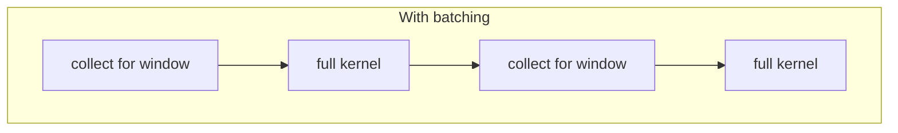
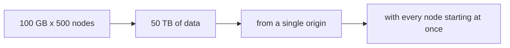
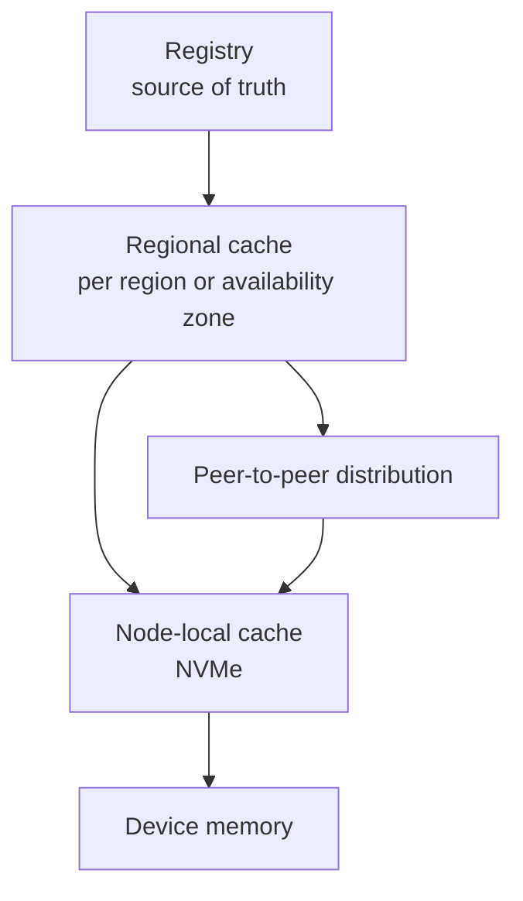

# 4. Inference Serving and Model Distribution

This section covers the data path from a client request to a result, and the
distribution path by which model artifacts reach the nodes that serve them.

## 4.1 Serving architecture

The components that carry the design are the batcher, which converts individual
requests into work of a size the device executes efficiently, and the autoscaler,
which scales on a metric that reflects demand for the device rather than
utilization of the host CPU.

## 4.2 Batching

A GPU executes large, uniform work more efficiently than it executes many small
work items. Serving requests individually produces a large number of short
kernels whose duration is comparable to the kernel launch overhead, and it leaves
the device underutilized as a result.

Dynamic batching collects the requests that arrive within a short interval and
executes them as a single batch. The length of that interval is the parameter
that determines the tradeoff between throughput and latency.

A larger batch increases throughput and improves utilization of the device. It
also increases latency, because a request that arrives shortly after a batch has
closed waits for the whole of the next interval. A fixed window places a
predictable bound on the added latency, while an adaptive window produces better
utilization under load at the cost of being more difficult to reason about.

Since batching couples requests together, degradation appears in the tail of the
latency distribution before it appears in the mean. A latency objective should
therefore be expressed at a high percentile, and the window selected so that the
objective is met across the expected distribution of arrivals.

## 4.3 Autoscaling

Host CPU utilization is a poor scaling signal for GPU serving, because the host
process is largely waiting on the device. Signals that correspond to actual
demand are the following.

| Signal | Interpretation |
|---|---|
| Queue depth per model | The quantity of demand that is not being served |
| Device utilization | Whether the devices are occupied |
| Batch latency or time to first token | Adherence to the latency objective |
| Requests per second per replica | Available capacity |

Scaling directly on the objective, for example by adding replicas when a high
percentile of latency exceeds its target, avoids the need to model the
relationship between utilization and latency, which varies by workload.

## 4.4 Cold start

Loading a large model into device memory takes seconds to minutes, depending on
the size of the model, the storage path, and memory bandwidth. Where replicas are
allowed to scale to zero, the first request after an idle period incurs that cost
and will exceed its latency objective.

| Technique | Effect | Cost |
|---|---|---|
| Minimum warm replicas | Bounds worst-case latency | Device time that is idle |
| Pre-pulled images and weights | Removes downloading from the critical path | Node storage |
| Node-local weight cache | Reduces a cold load to memory-mapped reads | Storage and cache management |
| Scheduled pre-scaling | Adds capacity before predicted peaks | Requires traffic forecasting |
| Queueing during load | Avoids errors while a replica initializes | Requests wait |

For very large models the load may be limited by storage bandwidth, in which case
the time required to read the weights exceeds the time required to compute with
them. Under those conditions the hit rate of the local cache becomes a primary
serving metric.

## 4.5 Multi-tenancy

Running several tenants on one device requires an explicit choice of isolation
mechanism, as described in section 2.5. The properties relevant to serving are
the following.

Memory isolation determines whether one tenant can disrupt another by exhausting
device memory, and only MIG provides hardware separation for this purpose. Time
slicing introduces context switches whose latency a tenant does not control and
cannot bound, which affects tail latency. Attribution of utilization is
approximate under time slicing and precise under MIG, which matters where usage
is metered.

For multi-tenant serving that must meet a latency objective, MIG or exclusive
devices are the defensible choices.

## 4.6 Model distribution

### Scale of the problem

Consider a model of 100 GB that has to be delivered to 500 nodes.

Three factors compound in this situation: the total volume, the fact that the
volume passes through a single origin, and the fact that the requests are
synchronized. Because the nodes start together, the last node to finish also
determines the completion time of the deployment, so the distribution of
completion times is the relevant measurement rather than the mean.

### Design

Artifacts are referenced by digest rather than by mutable tag. This permits any
cache layer to verify what it holds, allows entries to be keyed without
ambiguity, and lets identical content be shared between versions.

Caching is layered across regions and nodes, so that most requests are satisfied
without reaching the origin. Where a model is packaged as a set of layers, only
the layers that differ are transferred.

Once a subset of nodes holds a portion of an artifact, those nodes serve it to
peers. This converts a transfer from a single source into a mesh and removes the
origin from the steady-state path.

Rollout is performed in waves rather than to all nodes at once, since the
conditions that produce contention at the origin also apply at each cache layer.

### Cache correctness

A node-local cache has to account for live references. Evicting a model that a
running workload is still using turns a cache miss into a failure. The cache
therefore requires reference counting tied to workload lifetime, and eviction has
to respect the references that are currently active.

### Metrics

| Metric | Purpose |
|---|---|
| Time to first byte | Whether the origin is the limiting factor |
| Cache hit rate per layer | Whether layering is producing the intended effect |
| Distribution of node completion time | The duration of the deployment |
| Egress volume | A cost driver that scales with the number of nodes |

## 4.7 Summary

Requests are batched to match the operating point at which the device is
efficient, and the latency objective is expressed at a high percentile. Scaling
is driven by queue depth or objective adherence rather than host CPU utilization.
Cold start is treated as a capacity parameter rather than as an edge case. The
isolation mechanism is chosen explicitly, since time slicing and MIG differ in
kind. Large artifacts are distributed through content-addressed, layered caches
with a peer-to-peer final hop, in staggered waves, and the node-local cache is
reference counted against running workloads.
