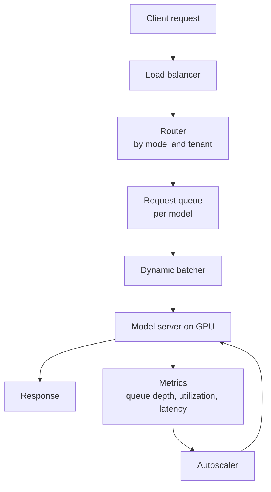
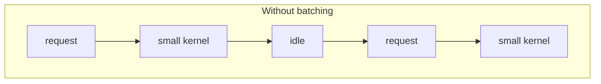
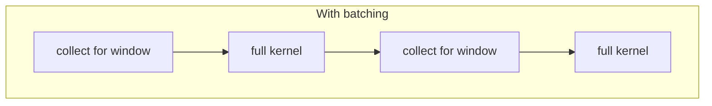
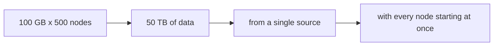
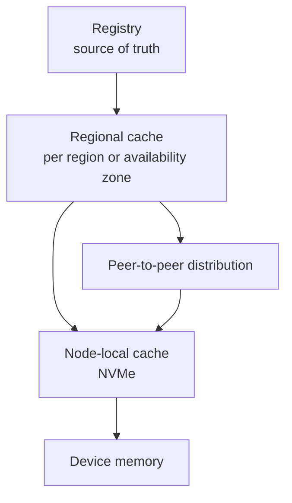

# 4. Inference Serving and Model Distribution

This section covers the data path from a client request to a result, and the
distribution path by which model artifacts reach the nodes that serve them.

## 4.1 Serving architecture

The components that carry the design are the **batcher**, which converts
individual requests into efficient GPU work, and the **autoscaler**, which must
scale on a metric that reflects GPU demand rather than host CPU utilization.

## 4.2 Batching

A GPU is most efficient on large, uniform work. Serving individual requests
produces many small kernels with launch overhead comparable to execution time,
and leaves the device underutilized.

Dynamic batching collects requests that arrive within a short window and executes
them as one batch. The window length is the tuning parameter:

| Effect | Consequence |
|---|---|
| Larger batch | Higher throughput, better device utilization |
| Larger batch | Higher latency; a request arriving just after a batch closes waits a full cycle |
| Fixed window | Predictable worst-case added latency |
| Adaptive window | Better utilization under load, more complex to reason about |

Because batching couples requests, tail latency degrades before mean latency
does. A latency SLO should be expressed at a high percentile, and the window
chosen to satisfy it under the expected arrival distribution.

## 4.3 Autoscaling

CPU utilization is a poor scaling signal for GPU serving, because the host
process is mostly waiting on the device. Relevant signals are:

| Signal | Indicates |
|---|---|
| Queue depth per model | Direct measure of unmet demand |
| Device utilization | Whether the devices are actually busy |
| Time to first token or batch latency | Adherence to the SLO |
| Requests per second per replica | Capacity headroom |

Scaling on the SLO directly (for example, scaling out when p99 latency exceeds
target) avoids having to model the relationship between utilization and latency,
which is workload-dependent.

## 4.4 Cold start

Loading a large model into device memory takes seconds to minutes depending on
size, storage path, and memory bandwidth. If replicas scale to zero, the first
request after an idle period pays that cost and will violate its latency target.

| Technique | Effect | Cost |
|---|---|---|
| Warm minimum replicas | Bounds worst-case latency | Idle GPU time |
| Pre-pulled images and weights | Removes download from the critical path | Node disk |
| Node-local weight cache | Turns a cold load into a memory-mapped read | Disk plus cache management |
| Scheduled pre-scaling | Scales before predicted peaks | Requires traffic forecasting |
| Request queueing during load | Prevents errors while a replica warms | Requests wait |

For large models, the load itself may be bandwidth bound: the time to read the
weights from storage exceeds the time to compute anything. This makes the local
cache hit rate a first-order serving metric.

## 4.5 Multi-tenancy and isolation

Running several tenants on one device requires an explicit isolation choice from
section 2.5. The relevant properties for serving are:

- **Memory isolation.** A tenant that can exhaust device memory can disrupt
  co-resident tenants. Only MIG provides hardware separation.
- **Tail latency.** Time slicing introduces context switches whose latency the
  tenant does not control and cannot bound.
- **Accounting.** Utilization attribution is approximate under time slicing and
  precise under MIG.

For latency-sensitive multi-tenant serving, MIG or exclusive devices are the
defensible choices.

## 4.6 Model distribution

### The arithmetic comes first

Consider a 100 GB model that must reach 500 nodes:

Three problems compound here: the total volume, the concentration of that volume
through one endpoint, and the synchronization of the requests. A simultaneous
start also means the last node to finish determines deployment completion time,
so the mean is not the useful metric — the tail is.

### Design

**Content addressing.** Artifacts are referenced by digest rather than by mutable
tag. This lets any cache layer validate what it holds, key entries safely, and
share identical content between versions.

**Layered caching.** Caches exist at region and node level, so that the majority
of requests are satisfied without reaching the origin. For models packaged as
layers, only changed layers transfer.

**Peer-to-peer distribution.** Once a subset of nodes holds a chunk, they serve
it to peers. This converts a single-source transfer into a mesh and removes the
origin from the steady-state path.

**Controlled rollout.** Roll out in waves rather than to all nodes simultaneously.
The stampede problem exists at every cache layer, and wave-based rollout avoids
recreating it one level down.

### Cache correctness

A node-local cache must track live references. Evicting a model that a running
pod is still using converts a cache miss into a failure. The cache therefore
needs reference counting tied to workload lifetime, and eviction must respect
active references.

### Metrics

| Metric | Purpose |
|---|---|
| Time to first byte | Whether the origin is the bottleneck |
| Cache hit rate per layer | Whether layering is effective |
| Distribution of node completion time | The real deployment duration |
| Egress volume | Cost driver, scales with node count |

## 4.7 Design summary

- Batch requests to match the device's efficient operating point, and express the
  latency SLO at a high percentile.
- Scale on queue depth or SLO adherence, not host CPU.
- Treat cold start as a first-class capacity parameter, not an edge case.
- Choose the isolation model explicitly; time slicing and MIG differ in kind.
- Distribute large artifacts through content-addressed, layered caches with a
  peer-to-peer final hop, and roll out in waves.
- Reference-count the node-local cache against running workloads.
