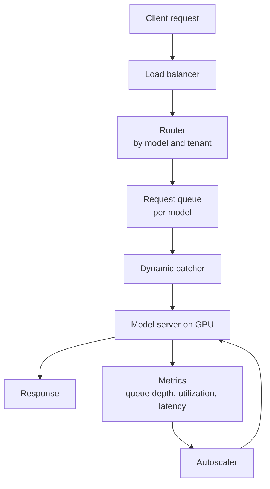
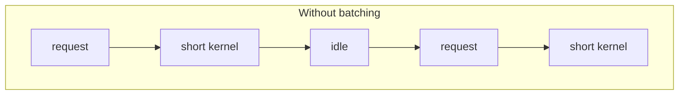
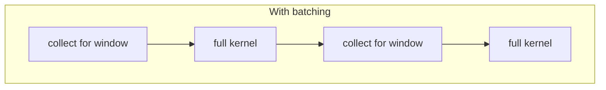
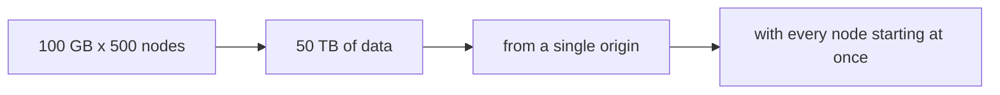
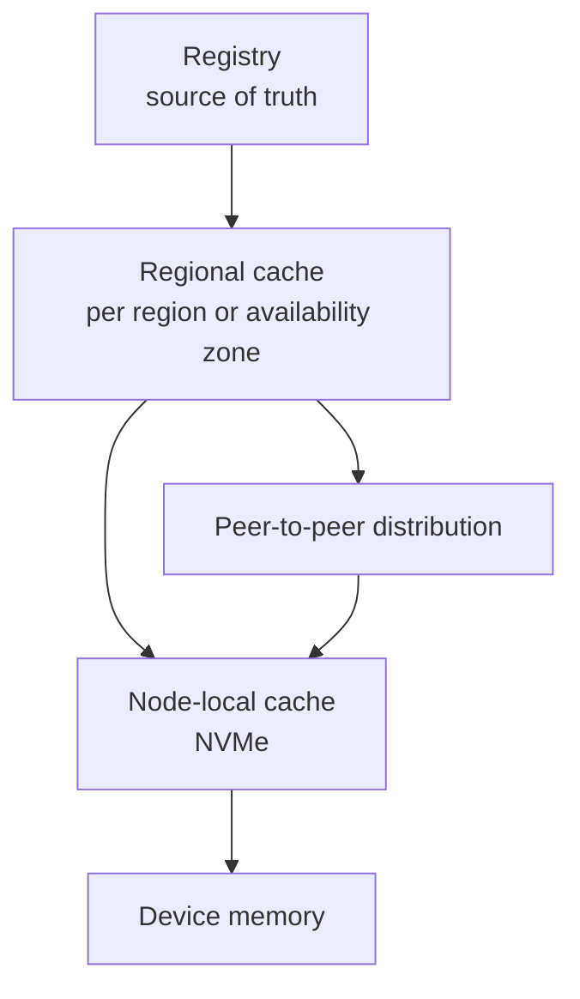

# 4. Inference Serving and Model Distribution

## 4.1 Serving architecture

The batcher converts individual requests into work the device executes
efficiently. The autoscaler scales on a metric that reflects demand for the
device, rather than host CPU utilization.

## 4.2 Batching

A GPU executes large uniform work more efficiently than many small items. Serving
requests individually produces many short kernels whose duration is close to the
launch overhead, which leaves the device underused.

Dynamic batching gathers requests arriving within a short interval and runs them
as one batch. The length of that interval sets the throughput-latency tradeoff.

A larger batch raises throughput and utilization. It also raises latency, because
a request arriving just after a batch closes waits the whole next interval. A
fixed window bounds the added latency predictably. An adaptive window uses the
device better under load but is harder to reason about.

Batching couples requests together, so degradation shows in the latency tail
before it shows in the mean. Express the latency objective at a high percentile,
and choose the window to meet it across the expected distribution of arrivals.

## 4.3 Autoscaling

Host CPU utilization is a poor scaling signal, because the host process mostly
waits on the device. Signals that track demand:

| Signal | Interpretation |
|---|---|
| Queue depth per model | Demand that is not being served |
| Device utilization | Whether the devices are occupied |
| Batch latency or time to first token | Adherence to the latency objective |
| Requests per second per replica | Available capacity |

Scaling on the objective directly, for example adding replicas when a high
percentile of latency exceeds target, avoids having to model the relationship
between utilization and latency. That relationship varies by workload.

## 4.4 Cold start

Loading a large model into device memory takes seconds to minutes, depending on
model size, storage path, and memory bandwidth. If replicas scale to zero, the
first request after an idle period pays that cost and misses its latency
objective.

| Technique | Effect | Cost |
|---|---|---|
| Minimum warm replicas | Bounds worst-case latency | Device time that is idle |
| Pre-pulled images and weights | Removes downloading from the critical path | Node storage |
| Node-local weight cache | Reduces a cold load to memory-mapped reads | Storage and cache management |
| Scheduled pre-scaling | Adds capacity before predicted peaks | Requires traffic forecasting |
| Queueing during load | Avoids errors while a replica initializes | Requests wait |

For very large models the load is limited by storage bandwidth, so reading the
weights takes longer than computing with them. The local cache hit rate then
becomes a primary serving metric.

## 4.5 Multi-tenancy

Several tenants on one device need an explicit isolation choice, as described in
section 2.5.

Memory isolation decides whether one tenant can disrupt another by exhausting
device memory, and only MIG provides hardware separation for this.

Time slicing introduces context switches whose latency a tenant cannot control or
bound, which affects the tail.

Usage attribution is approximate under time slicing and exact under MIG, which
matters where usage is metered.

For multi-tenant serving with a latency objective, MIG or exclusive devices are
the defensible choices.

## 4.6 Model distribution

### Scale

Consider a model of 100 GB delivered to 500 nodes.

Three factors compound: the total volume, the passage of that volume through a
single origin, and the synchronized start. Because the nodes start together, the
last node to finish sets the deployment completion time, so the distribution of
completion times is the useful measurement rather than the mean.

### Design

Reference artifacts by digest rather than by mutable tag. Any cache layer can
then verify what it holds, entries key unambiguously, and identical content is
shared between versions.

Cache at region and node level, so most requests never reach the origin. Where a
model is packaged in layers, only the layers that changed are transferred.

Once some nodes hold a portion of the artifact, they serve it to peers. This
turns a single-source transfer into a mesh and removes the origin from the
steady-state path.

Roll out in waves rather than to all nodes at once. The conditions that congest
the origin also apply at each cache layer.

### Cache correctness

A node-local cache must track live references. Evicting a model that a running
workload still uses turns a cache miss into a failure. Reference counting tied to
workload lifetime is required, and eviction must respect the references that are
currently active.

### Metrics

| Metric | Purpose |
|---|---|
| Time to first byte | Whether the origin is the limiting factor |
| Cache hit rate per layer | Whether layering is producing the intended effect |
| Distribution of node completion time | The duration of the deployment |
| Egress volume | A cost driver that scales with the number of nodes |

## 4.7 Summary

Requests are batched to match the point at which the device is efficient, and the
latency objective is expressed at a high percentile. Scaling is driven by queue
depth or objective adherence rather than host CPU utilization. Cold start is
treated as a capacity parameter. The isolation mechanism is chosen explicitly,
since time slicing and MIG differ in kind. Large artifacts are distributed
through content-addressed, layered caches with a peer-to-peer final hop, in
staggered waves, and the node-local cache is reference counted against running
workloads.
