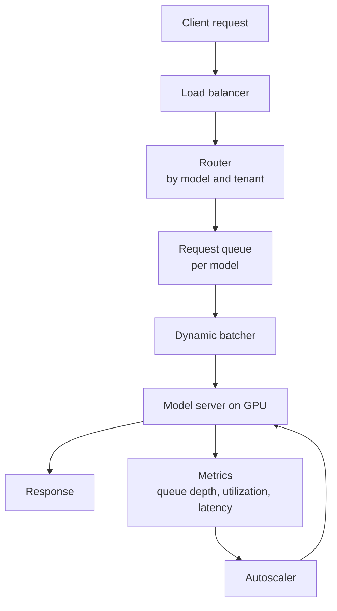
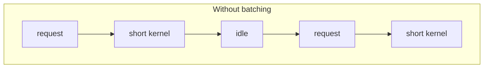
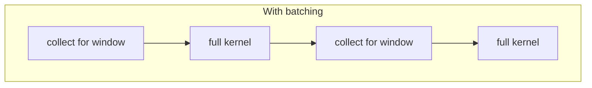
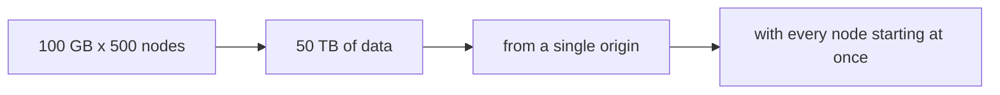
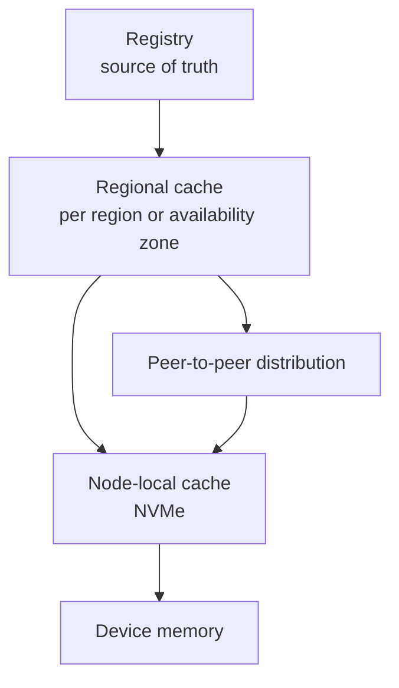

# 4. Inference Serving and Model Distribution

## 4.1 Serving architecture

The batcher turns individual requests into work the device executes efficiently.
The autoscaler watches a metric that tracks demand for the device, because host
CPU sits idle while the GPU does the work.

## 4.2 Batching

A GPU executes large uniform work efficiently and small items expensively.
Serving requests one at a time produces many short kernels whose duration is
close to the launch overhead, which leaves the device idle for much of the
interval.

Dynamic batching gathers the requests arriving within a short interval and runs
them as one batch. The length of that interval sets the throughput-latency
tradeoff.

A larger batch raises throughput and utilization, and it raises latency too: a
request arriving just after a batch closes waits the whole next interval. A fixed
window bounds that wait predictably. An adaptive window uses the device better
under load and takes more effort to reason about.

Batching couples requests, so degradation appears in the latency tail before it
appears in the mean. Set the latency objective at a high percentile and choose
the window that meets it across the arrival distribution you expect.

## 4.3 Autoscaling

Host CPU utilization tells you very little, because the host process spends its
time waiting on the device. These signals track demand instead.

| Signal | Interpretation |
|---|---|
| Queue depth per model | Demand that is not being served |
| Device utilization | Whether the devices are occupied |
| Batch latency or time to first token | Adherence to the latency objective |
| Requests per second per replica | Available capacity |

Scale on the objective directly, for example by adding replicas when a high
percentile of latency exceeds its target. That saves you from modelling the
relationship between utilization and latency, which shifts with every workload
you host.

## 4.4 Cold start

Loading a large model into device memory takes seconds to minutes, depending on
model size, storage path, and memory bandwidth. Let replicas scale to zero, and
the first request after an idle period pays that cost and misses its latency
objective.

| Technique | Effect | Cost |
|---|---|---|
| Minimum warm replicas | Bounds worst-case latency | Device time that is idle |
| Pre-pulled images and weights | Removes downloading from the critical path | Node storage |
| Node-local weight cache | Reduces a cold load to memory-mapped reads | Storage and cache management |
| Scheduled pre-scaling | Adds capacity before predicted peaks | Requires traffic forecasting |
| Queueing during load | Avoids errors while a replica initializes | Requests wait |

With a very large model, storage bandwidth caps the load, so reading the weights
takes longer than computing with them. The local cache hit rate then becomes a
primary serving metric.

## 4.5 Multi-tenancy

Putting several tenants on one device means choosing an isolation mechanism
explicitly, as section 2.5 sets out.

Memory isolation decides whether one tenant can disrupt another by exhausting
device memory, and MIG is the option that provides hardware separation.

Time slicing introduces context switches whose latency a tenant can neither
control nor bound, which lands in the tail.

Usage attribution is exact under MIG and approximate under time slicing, which
matters wherever you meter.

For multi-tenant serving with a latency objective, choose MIG or exclusive
devices.

## 4.6 Model distribution

### Scale

Consider a model of 100 GB delivered to 500 nodes.

Three factors compound here: the total volume, the passage of that volume through
a single origin, and the synchronized start. Because the nodes start together,
the last node to finish sets the deployment completion time. Measure the
distribution of completion times, since the mean hides the node that is still
downloading.

### Design

Reference each artifact by its digest. A digest identifies exact content, so any
cache can verify what it holds, keys stay unambiguous, and two versions that share
content share cache entries.

Cache at region level and at node level, so most requests reach a nearby copy
before they reach the origin. Package the model in layers, and a version bump
transfers only the layers that changed.

Once a few nodes hold a portion of the artifact, let them serve it to their
peers. That turns a single-source transfer into a mesh and keeps the origin off
the steady-state path.

Roll out in waves. The conditions that congest the origin apply equally at each
cache layer, and waves keep any single layer inside its capacity.

### Cache correctness

A node-local cache tracks live references. Evicting a model that a running
workload still uses turns a cache miss into a failure. Reference counting tied to
workload lifetime gives you that, and eviction then leaves active references
alone.

### Metrics

| Metric | Purpose |
|---|---|
| Time to first byte | Whether the origin is the limiting factor |
| Cache hit rate per layer | Whether layering is producing the intended effect |
| Distribution of node completion time | The duration of the deployment |
| Egress volume | A cost driver that scales with the number of nodes |

## 4.7 Summary

Batch requests to match the point at which the device is efficient, and set the
latency objective at a high percentile. Drive scaling from queue depth or
objective adherence, since host CPU utilization stays quiet either way. Treat
cold start as a capacity parameter. Choose the isolation mechanism explicitly,
because time slicing and MIG differ in kind. Distribute large artifacts through
content-addressed, layered caches with a peer-to-peer final hop, in staggered
waves, and reference count the node-local cache against running workloads.
