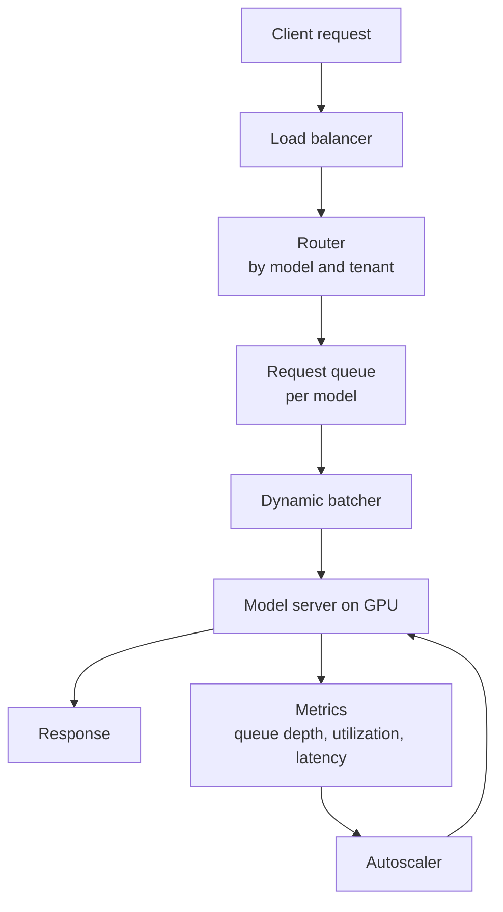
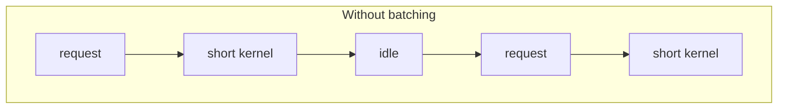
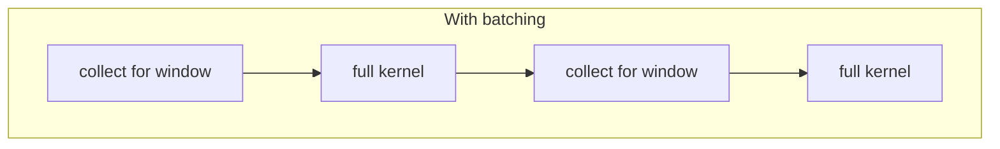
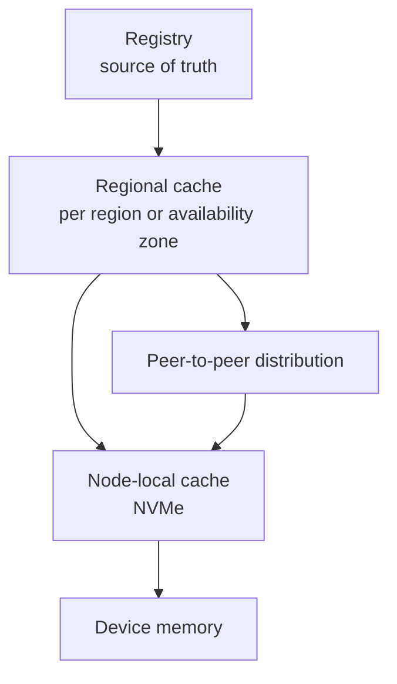

# 4. Inference Serving and Model Distribution

## 4.1 Serving architecture

The batcher turns individual requests into work the device executes efficiently.
The autoscaler watches demand for the device, since host CPU sits idle while the
GPU does the work.

## 4.2 Batching

Serving one request at a time produces short kernels whose duration is close to
the launch overhead, leaving the device idle for much of the interval. Dynamic
batching gathers the requests arriving within a window and runs them as one batch.
The window length sets the throughput-latency tradeoff.

A larger batch raises throughput and latency together, because a request arriving
just after a batch closes waits the whole next interval. A fixed window bounds that
wait predictably. An adaptive window uses the device better under load.

Batching couples requests, so degradation appears in the tail before the mean. Set
the latency objective at a high percentile and choose the window that meets it.

## 4.3 Autoscaling

Host CPU utilization tells you little, because the host process spends its time
waiting on the device. These signals track demand.

| Signal | Interpretation |
|---|---|
| Queue depth per model | Demand that is not being served |
| Device utilization | Whether the devices are occupied |
| Batch latency or time to first token | Adherence to the latency objective |
| Requests per second per replica | Available capacity |

Scale on the objective directly, adding replicas when a high percentile of latency
exceeds its target. That avoids modelling the relationship between utilization and
latency, which shifts with every workload you host.

## 4.4 Cold start

Loading a large model into device memory takes seconds to minutes. With replicas
scaled to zero, the first request after an idle period pays that cost and misses
its latency objective.

| Technique | Effect | Cost |
|---|---|---|
| Minimum warm replicas | Bounds worst-case latency | Device time that is idle |
| Pre-pulled images and weights | Removes downloading from the critical path | Node storage |
| Node-local weight cache | Reduces a cold load to memory-mapped reads | Storage and cache management |
| Scheduled pre-scaling | Adds capacity before predicted peaks | Requires traffic forecasting |
| Queueing during load | Avoids errors while a replica initializes | Requests wait |

With a very large model, storage bandwidth caps the load, so reading the weights
takes longer than computing with them. The local cache hit rate then becomes a
primary serving metric.

## 4.5 Multi-tenancy

MIG provides hardware separation of device memory. Time slicing provides none, so
one tenant exhausting device memory disrupts its neighbours, and its context
switches land in the tail where a tenant can neither control nor bound them.

Attribution is exact under MIG and approximate under time slicing, which matters
wherever you meter.

For multi-tenant serving with a latency objective, choose MIG or exclusive
devices.

## 4.6 Model distribution

### Scale

A model of 100 GB delivered to 500 nodes.

The volume, the single origin, and the synchronized start compound. The last node
to finish sets the deployment completion time, so measure the distribution of
completion times. The mean hides the node still downloading.

### Design

- Reference each artifact by digest, so caches verify content, keys stay
  unambiguous, and versions sharing content share entries.
- Cache at region level and node level, so most requests reach a nearby copy.
- Package the model in layers, so a version bump transfers only changed layers.
- Let nodes serve their peers once a few hold a portion of the artifact, which
  keeps the origin off the steady-state path.
- Roll out in waves, which holds each cache layer inside its capacity.

### Cache correctness

Track live references. Evicting a model that a running workload still uses turns a
cache miss into a failure. Reference counting tied to workload lifetime prevents
it, and eviction then leaves active references alone.

### Metrics

| Metric | Purpose |
|---|---|
| Time to first byte | Whether the origin is the limiting factor |
| Cache hit rate per layer | Whether layering is producing the intended effect |
| Distribution of node completion time | The duration of the deployment |
| Egress volume | A cost driver that scales with the number of nodes |
