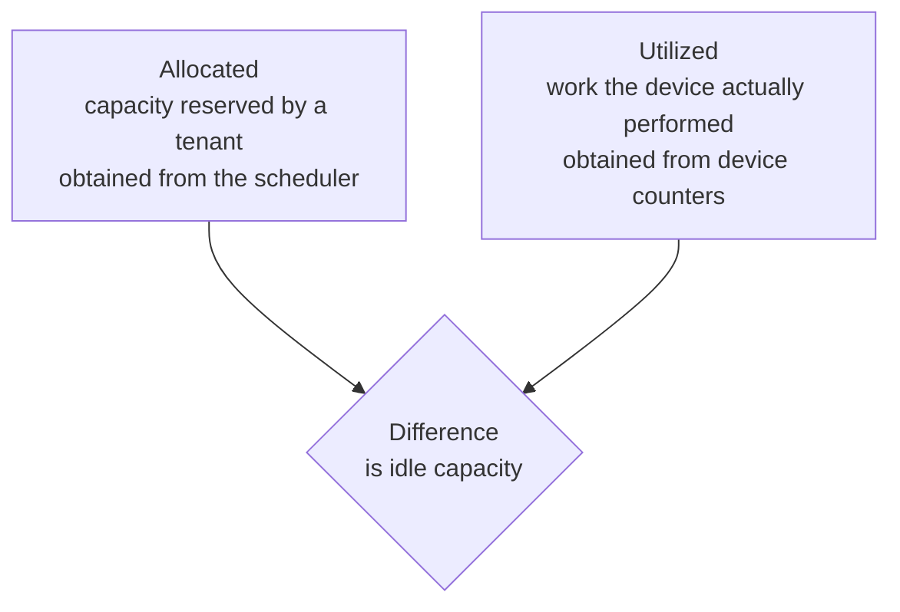
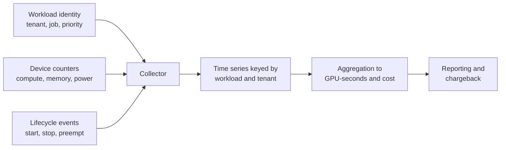
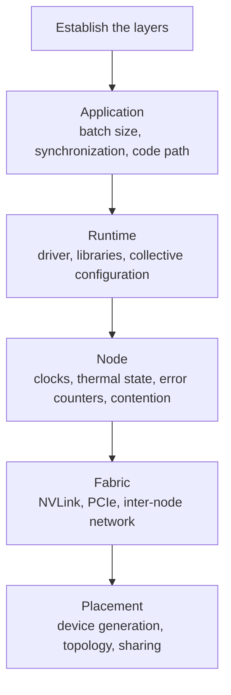

# 5. Operations: Metering and Diagnosis

This section covers the operational aspects of a GPU service: the measurement and
attribution of usage, and the diagnosis of performance regressions.

## 5.1 Metering

### Allocation and utilization

Two distinct quantities are involved in measuring GPU usage.

Billing on allocation alone allows a tenant to reserve a device and leave it
unused. Billing on utilization alone allows a tenant to hold an exclusive device
while consuming very little of it. Both quantities are needed, and the difference
between them is the operational signal that identifies unused reserved capacity.

### Collection

### Units of measure

| Dimension | Reason for including it |
|---|---|
| GPU-seconds | The primary unit of measurement |
| Device profile | A MIG partition and a complete device are not equivalent |
| Reserved memory | Accounts for workloads that cannot use an entire device |
| Idle time | Separates the cost of reservation from the cost of computation |
| Preemption events | Quantifies the benefit obtained from the lower-priority tier |

### Accuracy

On a device that is shared by time slicing, attribution is approximate. Counters
are sampled across processes that share the hardware, and per-tenant values will
not sum exactly to wall-clock utilization. This limitation is best documented
rather than presented as precise measurement.

On MIG, attribution is exact, because the partition is a hardware resource. This
is an operational advantage of MIG in addition to the isolation it provides.

### Attribution of distributed work

A training job that spans many ranks should be attributed to the workload
identity, and optionally divided by rank thereafter. Attributing usage by pod
would charge the job once for each rank and misrepresent the cost of the logical
unit of work.

## 5.2 Diagnosis of performance regressions

### Symptom

A workload that previously completed in four hours now requires seven, and the
code of the workload has not changed. The system reports no errors. This is the
characteristic form of a GPU performance regression: what changes is the rate at
which work completes, rather than whether the workload runs at all.

### Layer-by-layer examination

Two questions reduce the search space considerably. The first is whether the
regression is continuous or intermittent, since intermittent behavior indicates
contention or thermal effects while continuous behavior indicates configuration
or placement. The second is whether it affects a single workload or every
workload on the node, since the former points to the workload and the latter to
the node.

### Causes that occur most frequently

| Cause | Presentation |
|---|---|
| Contention from a co-resident workload | Slower only during activity by another tenant |
| Clock throttling | Reduced clocks caused by power or thermal limits, with utilization appearing normal |
| Degraded interconnect | Compute performance unchanged, collective performance reduced |
| Change in placement | Execution on a different device generation or a less favorable topology |
| Memory pressure | Additional paging or a reduction in effective batch size |
| Rising correctable error rate | Performance drift that precedes a hardware failure |
| Silent configuration change | A library selecting a slower execution path |

The first three account for a substantial proportion of reported regressions, and
none of them raises an error condition.

### Method

The workload should be reproduced before it is diagnosed, using the same data and
the same class of node. A regression requires comparison against a known-good
measurement, so two data points are needed. The physical layers are examined
first, because clock state, thermal state, and contention are inexpensive to rule
out and are frequently the cause. Only one variable should be changed at a time,
since simultaneous changes make the result difficult to interpret.

### Detection

Per-workload step time should be recorded as a metric in addition to device
utilization. Utilization measures whether the device was occupied, and it can
remain high while the rate of completed work falls. Alerting on changes in the
ratio of work completed to time elapsed detects this class of regression before
it is reported by users.

## 5.3 Summary

Allocation and utilization are both recorded, and the difference between them
identifies unused reserved capacity. The accuracy limits of attribution are
documented wherever devices are shared. Regressions are diagnosed by layer,
beginning with the physical layers and proceeding against a known-good
measurement. Progress rate per workload is instrumented in addition to device
utilization.
