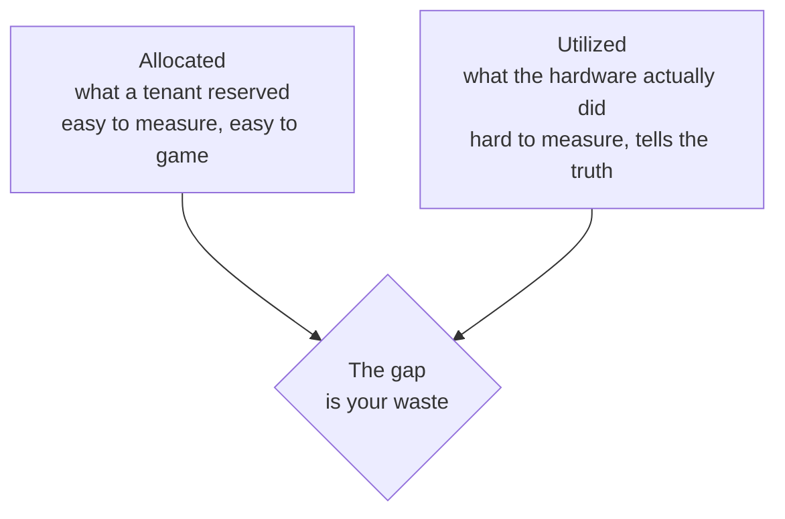
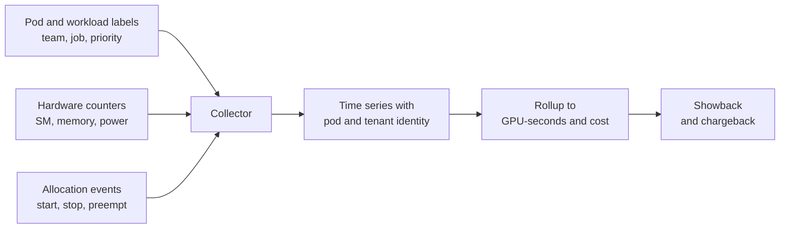
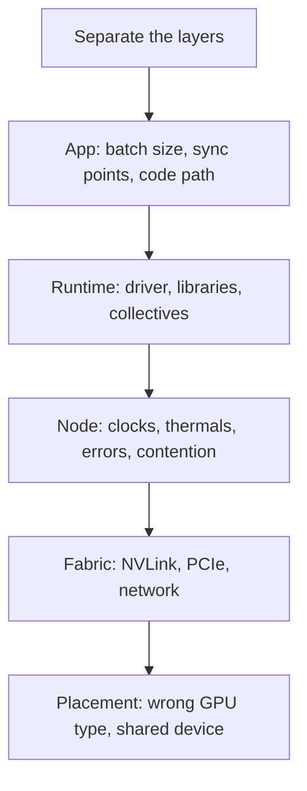

# 05. Operations: Metering and Debugging

Two questions you get once you claim seniority. One is about money, the other is
about not guessing.

---

## Q9. Who used which GPU, and what did it cost?

> Finance wants chargeback. Engineering wants to find waste. Design the metering
> system.

**What they are probing:** whether you understand that on shared GPUs,
accounting is a measurement problem with an honest error bar, and whether you
separate allocation from actual use.

### The two numbers you need

If you only bill on allocation, a tenant can reserve a whole GPU and run nothing.
If you only bill on utilization, a tenant holding a dedicated device pays nothing
while blocking others. Report both.

### The pipeline

### The unit

Use GPU-seconds, sliced by device profile. A MIG slice is not equal to a full
device, so billing them the same way is wrong in both directions.

| Dimension | Why it belongs |
|---|---|
| GPU-seconds | The primary unit |
| Profile | A slice must not be priced as a whole device |
| Memory reserved | Explains why a small job still costs |
| Idle time | The number that starts the right conversation |
| Preemption events | Shows where the low-priority tier actually helps |

### The honest caveat

On time-sliced GPUs, attribution is approximate. You are sampling counters
across processes that share the device, and the sum will not match wall clock.
Say that out loud instead of presenting a precise-looking number you cannot
defend. On MIG, accounting gets much cleaner because the partition is real.

**Follow-ups**

- How do you attribute a distributed training job across 64 pods? (Attribute to
  the workload identity, then split by rank if needed. Per-pod billing would
  punish the job for using the fleet.)
- What do you do about preempted work? (Bill the used seconds, not the requested
  ones, or tenants will be afraid of the preemption that makes the cluster efficient.)
- How does metering feed back into scheduling? (Quota enforcement and idle
  reclamation both read from the same time series.)

---

## Q10. "My job got slower."

> A customer opens a ticket: the same job took 4 hours last month and takes 7 now.
> Nothing in their code changed. Walk me through finding it.

**What they are probing:** whether you have a disciplined debugging path or you
start changing things. Also whether you know a GPU can be slow without failing.

### The path

### Start with the two questions that cut the space in half

1. **Is it always slow, or only at some times?** Intermittent points at a
   neighbor or a thermal issue. Consistent points at config or placement.
2. **Is it one job or all jobs on that node?** One job means the job. All jobs
   means the node.

### The usual suspects, ranked by how often they are the answer

| Suspect | Signature |
|---|---|
| Noisy neighbor on a shared GPU | Slower only when another tenant is busy |
| Throttling | Clocks dropped, temperature or power limit reached, utilization looks fine |
| Degraded interconnect | Compute is fast, collectives are slow, scaling efficiency fell |
| Wrong placement | Landed on a slower GPU type or a non-adjacent topology |
| Memory pressure | More page faults or out-of-memory retries, batch gets split |
| Error counters climbing | Correctable errors at a rising rate, pointing at failing hardware |
| Silent fallback | A library picked a slower path, so the symptom is config-shaped |

### The discipline

- **Reproduce before diagnosing.** Same job, same data, same node class.
- **Compare a known-good run.** A regression needs two data points.
- **Check the boring layers first.** Clocks, thermals, and neighbors explain
  more slowdowns than algorithmic regressions.
- **Do not change two things at once.** You will not learn which one mattered.

### The distinction worth stating out loud

A GPU that fails is easy. A GPU that is slow is hard, because every layer looks
healthy in isolation. The interconnect is the classic case: the job runs, the
results are correct, and the only symptom is that a distributed job scales worse
than it used to.

**Follow-ups**

- How do you detect a noisy neighbor without access to the other tenant?
  (Per-process memory activity and SM utilization from the device counters,
  correlated with the slowdown window.)
- What if only the p99 is slow, not the mean? (That is a queueing or contention
  signature, not a throughput regression.)
- How would you have caught this before the ticket? (Metric the per-job step time,
  not only utilization, and alert on a change in the ratio.)
