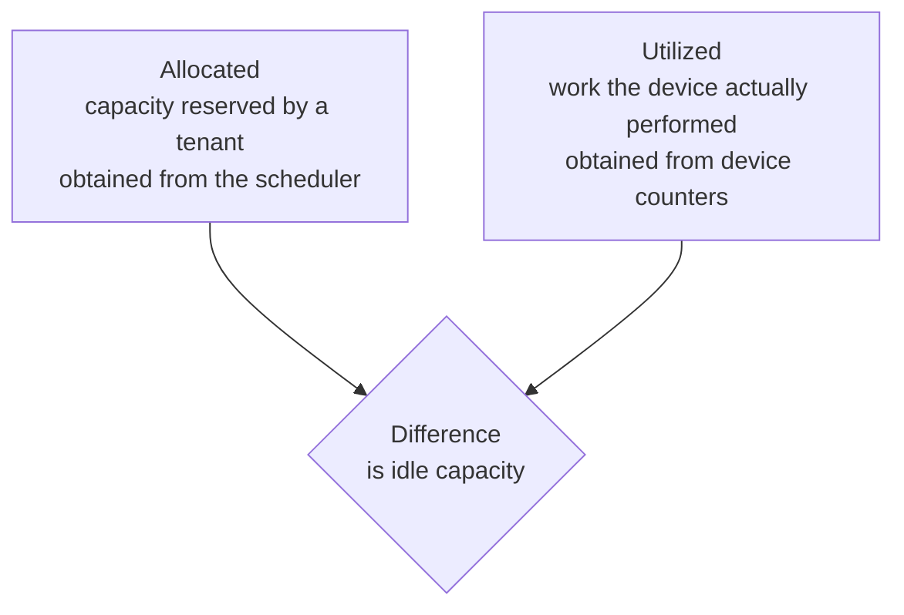
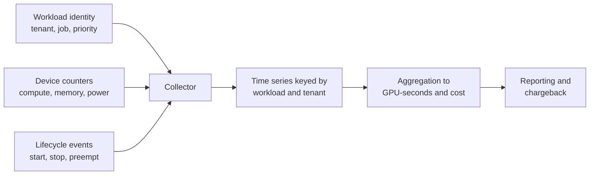
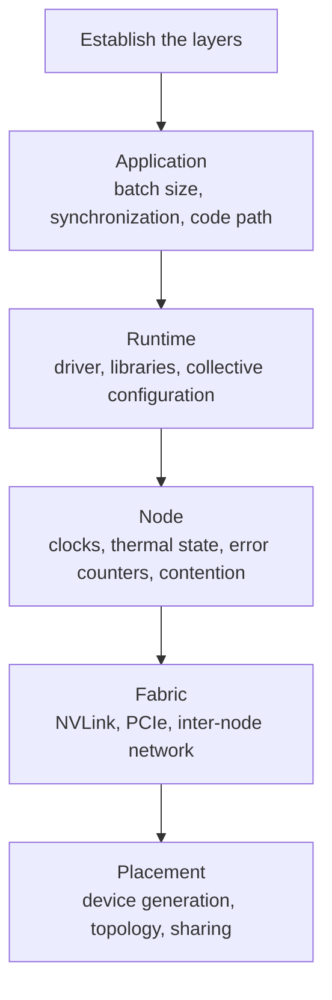

# 5. Operations: Metering and Diagnosis

This section covers how usage is measured and attributed, and how performance
regressions are diagnosed.

## 5.1 Metering

### Allocation and utilization

Two quantities are involved in measuring GPU usage.

Billing on allocation alone lets a tenant reserve a device and leave it unused.
Billing on utilization alone lets a tenant hold an exclusive device while using
little of it. Both quantities are needed, and their difference identifies unused
reserved capacity.

### Collection

### Units of measure

| Dimension | Reason for including it |
|---|---|
| GPU-seconds | The primary unit of measurement |
| Device profile | A MIG partition and a complete device are not equivalent |
| Reserved memory | Accounts for workloads that cannot use an entire device |
| Idle time | Separates the cost of reservation from the cost of computation |
| Preemption events | Quantifies the benefit obtained from the lower-priority tier |

### Accuracy

On a device shared by time slicing, attribution is approximate. Counters are
sampled across processes sharing the hardware, so per-tenant values do not sum
exactly to wall-clock utilization. Document the limitation rather than presenting
the numbers as precise.

On MIG, attribution is exact, because the partition is a hardware resource. MIG
therefore gives precise accounting as well as isolation.

### Attribution of distributed work

Attribute a multi-rank training job to the workload identity, and optionally
split by rank afterwards. Attributing usage by pod charges the job once for each
rank and misrepresents the cost of the logical unit of work.

## 5.2 Diagnosis of performance regressions

### Symptom

A workload that took four hours now takes seven. The code has not changed, and no
errors are reported. This is the usual form of a GPU performance regression: the
rate of completed work changes, while the workload still runs.

### Layer-by-layer examination

Two questions narrow the search. Is the regression continuous or intermittent?
Intermittent behavior points to contention or thermal effects, and continuous
behavior to configuration or placement. Does it affect one workload, or every
workload on the node? One points to the workload, and every one to the node.

### Causes that occur most frequently

| Cause | Presentation |
|---|---|
| Contention from a co-resident workload | Slower only during activity by another tenant |
| Clock throttling | Reduced clocks from power or thermal limits, with utilization appearing normal |
| Degraded interconnect | Compute performance unchanged, collective performance reduced |
| Change in placement | Execution on a different device generation or a less favorable topology |
| Memory pressure | Additional paging, or a reduction in effective batch size |
| Rising correctable error rate | Performance drift that precedes a hardware failure |
| Silent configuration change | A library selecting a slower execution path |

The first three explain a large share of reported regressions, and none of them
raises an error condition.

### Method

Reproduce the workload before diagnosing it, using the same data and the same
class of node. A regression needs comparison against a known-good measurement, so
two data points are required.

Check the physical layers first. Clock state, thermal state, and contention are
cheap to rule out and are often the cause. Change one variable at a time, because
simultaneous changes make the result hard to interpret.

### Detection

Record per-workload step time as a metric alongside device utilization.
Utilization measures whether the device was occupied, and it can stay high while
the rate of completed work falls. Alerting on the ratio of work completed to time
elapsed catches this class of regression before users report it.

## 5.3 Summary

Allocation and utilization are both recorded, and their difference identifies
unused reserved capacity. The accuracy limits of attribution are documented
wherever devices are shared. Regressions are diagnosed by layer, beginning with
the physical layers and proceeding against a known-good measurement. Progress
rate per workload is instrumented in addition to device utilization.
