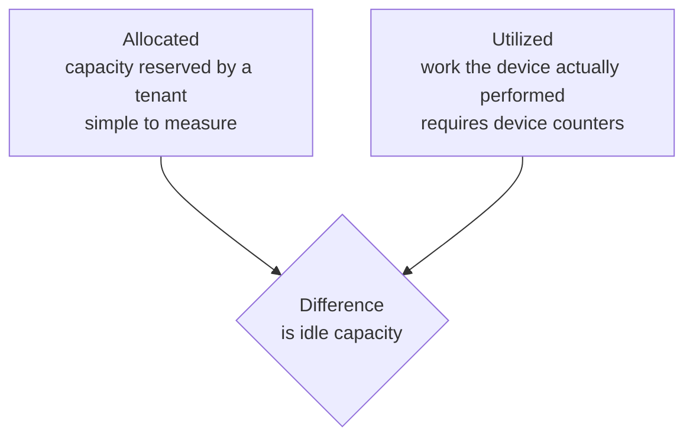
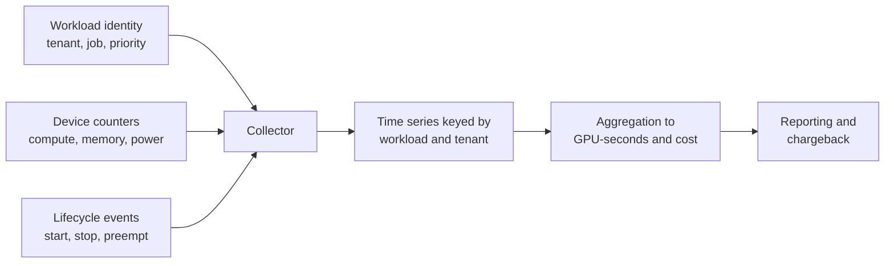
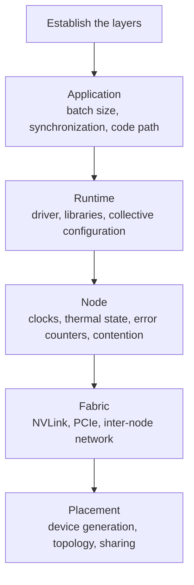

# 5. Operations: Metering and Diagnosis

This section covers the operational side of a GPU service: how usage is measured
and attributed, and how a performance regression is diagnosed without guessing.

## 5.1 Metering

### Allocation and utilization are different quantities

Billing on allocation alone lets a tenant reserve a device and leave it idle.
Billing on utilization alone lets a tenant hold an exclusive device while
consuming almost nothing. Both quantities are needed, and the difference between
them is the operational signal.

### Pipeline

### Units of measure

| Dimension | Reason |
|---|---|
| GPU-seconds | Primary unit |
| Device profile | A MIG partition is not equivalent to a full device |
| Reserved memory | Explains cost for workloads that cannot use the whole device |
| Idle time | Separates cost of reservation from cost of computation |
| Preemption events | Measures the benefit of the low-priority tier |

### Accuracy limits

On a time-sliced device, attribution is approximate. Counters are sampled across
processes sharing the hardware, and per-tenant values will not sum exactly to
wall-clock utilization. This limitation should be documented rather than
presented as precise measurement.

On MIG, attribution is exact, because the partition is a hardware resource. This
is a significant operational advantage of MIG beyond isolation.

### Attribution for distributed work

A multi-rank training job should be attributed to the workload identity, then
optionally split by rank. Attributing by pod would charge the job once per rank
and misrepresent the cost of the logical unit of work.

## 5.2 Diagnosing performance regressions

### The problem

A workload that previously completed in four hours now takes seven, with no
change to the workload's code. The system reports no errors. This is the
characteristic shape of a GPU performance regression: the failure is a change in
rate, not a failure to run.

### Layered diagnosis

### Two questions that narrow the search

1. **Is the regression continuous or intermittent?** Intermittent points to
   contention or thermal behavior. Continuous points to configuration or
   placement.
2. **Does it affect one workload or every workload on the node?** One workload
   indicates the workload. All workloads indicate the node.

### Common causes

| Cause | Presentation |
|---|---|
| Contention from a co-resident workload | Slower only during another tenant's activity |
| Clock throttling | Reduced clocks from power or thermal limits; utilization appears normal |
| Degraded interconnect | Compute performance unchanged, collective performance reduced |
| Placement change | Landed on a different device generation or a less favorable topology |
| Memory pressure | Additional paging or reduced effective batch size |
| Rising correctable error rate | Performance drift preceding a hardware failure |
| Silent configuration change | A library selected a slower execution path |

The first three account for a large share of reported regressions, and none of
them produces an error.

### Method

- **Reproduce before diagnosing.** Same workload, same data, same node class.
- **Compare against a known-good run.** A regression requires two measurements.
- **Check the physical layers first.** Clocks, thermals, and contention are
  cheap to rule out and frequently the cause.
- **Change one variable at a time.** Multiple simultaneous changes make the
  result uninterpretable.

### Detection rather than reaction

Per-workload step time should be recorded as a first-class metric, not only
device utilization. Utilization can remain high while throughput falls, because
it measures whether the device was busy, not whether it was productive. Alerting
on changes in the ratio of work completed to time elapsed detects the class of
regression described here before it is reported by users.

## 5.3 Summary

- Record both allocation and utilization; the difference is the signal.
- State the accuracy limits of attribution when devices are shared.
- Diagnose regressions by layer, from the physical upward, and always against a
  known-good measurement.
- Instrument per-workload progress rate, not only device utilization.
