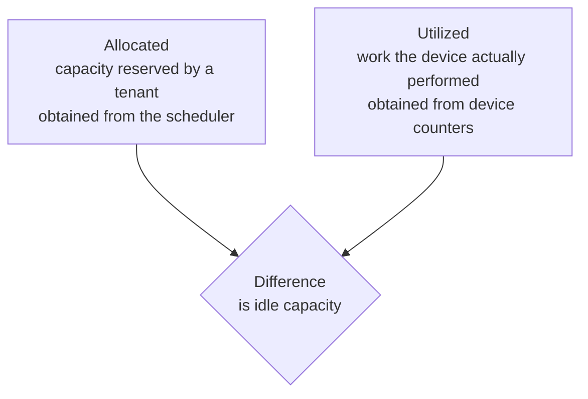
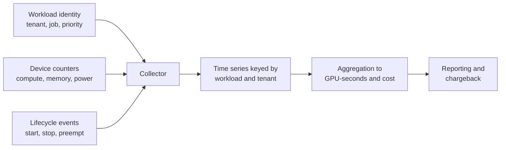
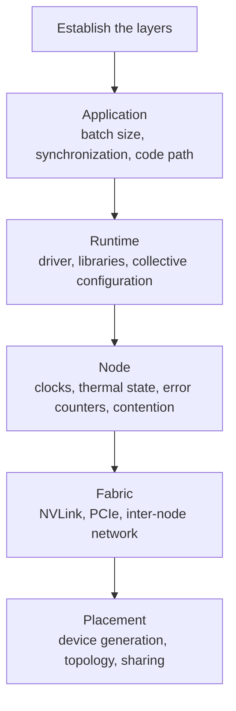

# 5. Operations: Metering and Diagnosis

## 5.1 Metering

### Allocation and utilization

Bill on allocation alone, and a tenant can reserve a device and leave it unused.
Bill on utilization alone, and a tenant can hold an exclusive device while using
a fraction of it. Record both, and the difference between them identifies the
reserved capacity that nobody is using.

### Collection

### Units of measure

| Dimension | Reason for including it |
|---|---|
| GPU-seconds | The primary unit of measurement |
| Device profile | A MIG partition and a complete device are different resources |
| Reserved memory | Accounts for workloads that use part of a device |
| Idle time | Separates the cost of reservation from the cost of computation |
| Preemption events | Quantifies the benefit obtained from the lower-priority tier |

### Accuracy

On a device shared by time slicing, attribution is approximate. The collector
samples counters across processes sharing the hardware, so per-tenant values
land near wall-clock utilization and rarely sum to it exactly. Document the
limitation. A sampled number presented as precise invites a dispute you cannot
settle.

On MIG, attribution is exact, because the partition is a hardware resource. MIG
buys you precise accounting alongside the isolation.

### Attribution of distributed work

Attribute a multi-rank training job to the workload identity, and optionally
split by rank afterwards. Attributing usage by pod charges the job once for each
rank and misrepresents the cost of the logical unit of work.

## 5.2 Diagnosis of performance regressions

### Symptom

A workload that took four hours now takes seven. The code has not changed, and no
errors are reported. Work still completes correctly; the rate has fallen.

### Layer-by-layer examination

Ask first whether the regression is continuous or intermittent. Intermittent
behavior points at contention or thermal effects, and continuous behavior at
configuration or placement.

Then ask whether it affects one workload or every workload on the node. One
points at the workload, and every one at the node.

### Causes that occur most frequently

| Cause | Presentation |
|---|---|
| Contention from a co-resident workload | Slower only during activity by another tenant |
| Clock throttling | Reduced clocks from power or thermal limits, with utilization appearing normal |
| Degraded interconnect | Compute performance unchanged, collective performance reduced |
| Change in placement | Execution on a different device generation or a less favorable topology |
| Memory pressure | Additional paging, or a reduction in effective batch size |
| Rising correctable error rate | Performance drift that precedes a hardware failure |
| Silent configuration change | A library selecting a slower execution path |

The first three explain a large share of reported regressions, and all three
leave the system running and error-free.

### Method

Reproduce the workload before diagnosing it, using the same data and the same
class of node. A regression needs a known-good measurement to compare against, so
collect two data points.

Check the physical layers first. Clock state, thermal state, and contention are
cheap to rule out and often turn out to be the cause. Change one variable at a
time, because simultaneous changes leave you unable to interpret the result.

### Detection

Record per-workload step time as a metric alongside device utilization.
Utilization records whether the device was occupied, and it can stay high while
the rate of completed work falls. Alert on the ratio of work completed to time
elapsed, and you catch this class of regression before users report it.

## 5.3 Summary

Record allocation and utilization, and read the difference as unused reserved
capacity. Document the accuracy limits of attribution wherever devices are
shared. Diagnose regressions by layer, starting with the physical layers and
comparing against a known-good measurement. Instrument progress rate per
workload alongside device utilization.
