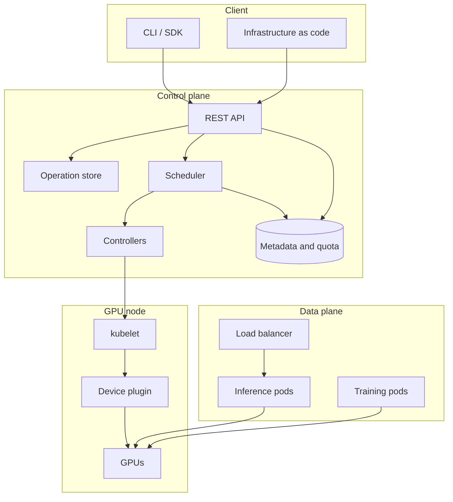

# GPU and Cloud Systems Design

A reference for designing GPU-backed cloud services. It covers the GPU execution
model, cluster scheduling and sharing, the control plane and its client libraries,
inference serving, model distribution, and operations.

Each section gives the background, a design, and the tradeoffs. Diagrams use
Mermaid and render on GitHub.

## Contents

| Section | Topic | File |
|---|---|---|
| 1 | GPU execution model and data movement | [01](01-gpu-execution-model.md) |
| 2 | Cluster scheduling and GPU sharing | [02](02-gpu-cluster-scheduling.md) |
| 3 | Control plane, API design, and failure handling | [03](03-gpu-cloud-control-plane.md) |
| 4 | Inference serving and model distribution | [04](04-serving-and-artifacts.md) |
| 5 | Operations: metering, audit, and diagnosis | [05](05-operations-and-cost.md) |

## System overview

### Layer responsibilities

| Layer | Responsibility | Principal concerns |
|---|---|---|
| Client | Express intent and hide transport details | Retries, pagination, credentials, configuration precedence |
| Control plane | Validate, persist, place, and track work | Idempotency, asynchronous operations, quota, audit |
| Data plane | Execute workloads and serve traffic | Batching, autoscaling, isolation, cold start |
| Node | Expose and assign physical devices | Health reporting, allocation, topology |

## Properties of GPU resources

Four properties of GPU hardware drive most design decisions in this domain.

### Allocation granularity

GPU capacity is an extended resource in Kubernetes. Quantities are whole numbers,
and the request must equal the limit. Allocating less than a full device requires
either a hardware partition such as MIG, or cooperative sharing such as time
slicing or MPS. These differ in isolation and in how accurately usage can be
measured.

### Preemption cost

Device state cannot be saved and restored cheaply. Preemption stops a workload and
restarts it later; it does not suspend it. Checkpoint frequency is therefore a
scheduling parameter as well as a reliability one.

### Data movement

Device memory bandwidth is high. Host transfer bandwidth over PCIe is roughly an
order of magnitude lower, and inter-node fabric is lower again. Any design that
moves data frequently has a data movement problem, however the compute is
written.

### Heterogeneity

Device generation, memory capacity, and interconnect determine what a workload
can run and how well it scales. Placement affects both correctness and
efficiency.

## Conventions

- Latency and bandwidth figures are order-of-magnitude values for reasoning about
  which term dominates. They are not suitable for capacity planning.
- "Node" means a machine hosting GPUs. "Device" means one GPU.
- Kubernetes behavior refers to upstream semantics for the current stable
  release.
