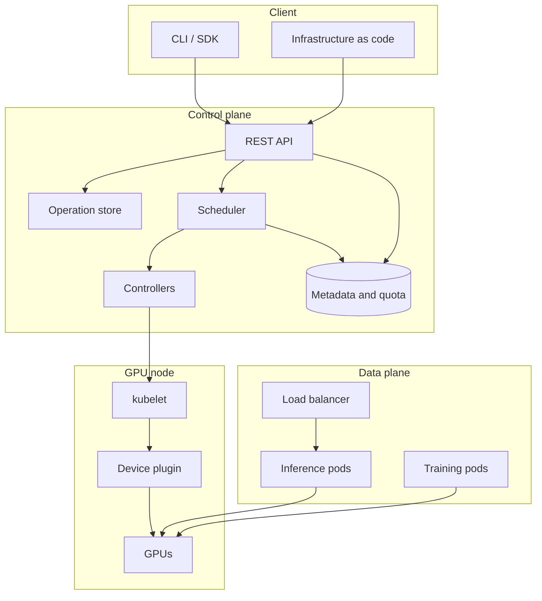

# GPU and Cloud Systems Design

Design reference for GPU-backed cloud services: the GPU execution model, cluster
scheduling and sharing, the control plane and its client libraries, inference
serving, model distribution, and operations.

Diagrams use Mermaid and render on GitHub.

## Contents

| Section | Topic | File |
|---|---|---|
| 1 | GPU execution model and data movement | [01](01-gpu-execution-model.md) |
| 2 | Cluster scheduling and GPU sharing | [02](02-gpu-cluster-scheduling.md) |
| 3 | Control plane, API design, and failure handling | [03](03-gpu-cloud-control-plane.md) |
| 4 | Inference serving and model distribution | [04](04-serving-and-artifacts.md) |
| 5 | Operations: metering, audit, and diagnosis | [05](05-operations-and-cost.md) |

## System overview

### Layer responsibilities

| Layer | Responsibility | Principal concerns |
|---|---|---|
| Client | Express intent and hide transport details | Retries, pagination, credentials, configuration precedence |
| Control plane | Validate, persist, place, and track work | Idempotency, asynchronous operations, quota, audit |
| Data plane | Execute workloads and serve traffic | Batching, autoscaling, isolation, cold start |
| Node | Expose and assign physical devices | Health reporting, allocation, topology |

## Properties of GPU resources

### Allocation granularity

GPU capacity is an extended resource in Kubernetes. Quantities are whole numbers,
and the request must equal the limit. Allocating less than a full device requires
either a hardware partition such as MIG, or cooperative sharing such as time
slicing or MPS. The two differ in the isolation they provide and in how
accurately usage can be attributed.

### Preemption cost

Saving and restoring device state costs milliseconds and device memory.
Preemption therefore stops a workload and restarts it later. The checkpoint
interval sets both the cost of preempting a job and the amount of work a hardware
failure discards.

### Data movement

Device memory bandwidth is on the order of TB/s. PCIe host-to-device bandwidth is
tens of GB/s, and inter-node fabric is lower again. A design that moves data every
iteration spends its time on the slowest of those links.

### Heterogeneity

Device generation, memory capacity, and interconnect determine what a workload
can run and how well it scales. A job placed on a device with too little memory
does not run at all, so placement affects correctness as well as efficiency.

## Conventions

- Latency and bandwidth figures are approximate and intended for reasoning about
  which term dominates. They are not suitable for capacity planning.
- "Node" means a machine hosting GPUs. "Device" means one GPU.
- Kubernetes behavior refers to upstream semantics for the current stable
  release.
