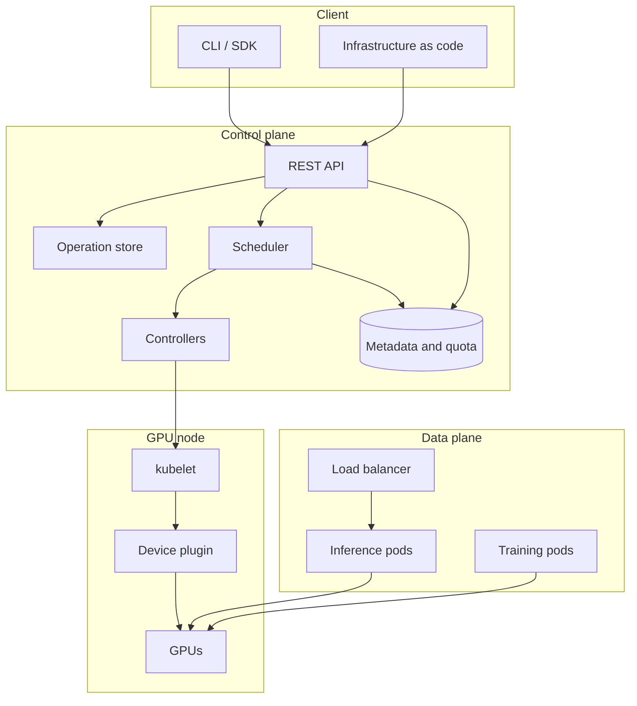

# GPU and Cloud Systems Design

This guide covers how GPU-backed cloud services are built: the GPU execution
model, cluster scheduling and sharing, the control plane and its client
libraries, inference serving, model distribution, and operations.

Each section introduces the concept, then shows how it behaves in a working
system, then gives the design. Diagrams use Mermaid and render on GitHub.

## Contents

| Section | Topic | File |
|---|---|---|
| 1 | GPU execution model and data movement | [01](01-gpu-execution-model.md) |
| 2 | Cluster scheduling and GPU sharing | [02](02-gpu-cluster-scheduling.md) |
| 3 | Control plane, API design, and failure handling | [03](03-gpu-cloud-control-plane.md) |
| 4 | Inference serving and model distribution | [04](04-serving-and-artifacts.md) |
| 5 | Operations: metering, audit, and diagnosis | [05](05-operations-and-cost.md) |

## System overview

### Layer responsibilities

| Layer | Responsibility | Principal concerns |
|---|---|---|
| Client | Express intent and hide transport details | Retries, pagination, credentials, configuration precedence |
| Control plane | Validate, persist, place, and track work | Idempotency, asynchronous operations, quota, audit |
| Data plane | Execute workloads and serve traffic | Batching, autoscaling, isolation, cold start |
| Node | Expose and assign physical devices | Health reporting, allocation, topology |

## Properties of GPU resources

### Allocation granularity

Kubernetes represents GPU capacity as an extended resource. You ask for whole
units: 1, 2, or 4 GPUs. Kubernetes grants a unit to one pod at a time, so
extended resources carry no oversubscription, and the request you write equals
the limit.

Putting more than one workload on a device means choosing between a hardware
partition such as MIG and a sharing mechanism such as time slicing or MPS. Each
option comes with its own isolation and its own accuracy of measurement, and
section 2.5 compares them.

### Preemption cost

Saving and restoring device state costs milliseconds and a slice of device
memory, so a GPU workload is preempted by stopping it and starting it again
later. That makes the checkpoint interval the number that decides how much work a
preemption costs, and how much a hardware failure discards.

### Data movement

Device memory moves data at terabytes per second. PCIe host-to-device moves it at
tens of gigabytes per second, and inter-node fabric runs slower again. A design
that moves data on every iteration spends most of its time on the slowest link in
that chain.

### Heterogeneity

Device generation, memory capacity, and interconnect decide what a workload can
run and how well it scales. A job that needs 80 GB of device memory will not
start on a 40 GB card, which makes placement a correctness decision as well as a
performance one.

## Conventions

- Latency and bandwidth figures are approximate and intended for reasoning about
  which term dominates. They are not suitable for capacity planning.
- "Node" means a machine hosting GPUs. "Device" means one GPU.
- Kubernetes behavior refers to upstream semantics for the current stable
  release.
