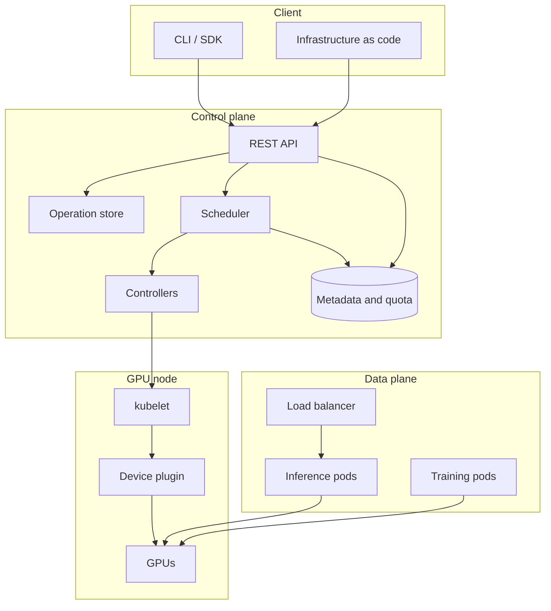

# GPU and Cloud Systems Design

GPU execution model, cluster scheduling and sharing, the control plane and its
client libraries, inference serving, model distribution, and operations. Diagrams
are Mermaid and render on GitHub.

## Contents

| Section | Topic | File |
|---|---|---|
| 1 | GPU execution model and data movement | [01](01-gpu-execution-model.md) |
| 2 | Cluster scheduling and GPU sharing | [02](02-gpu-cluster-scheduling.md) |
| 3 | Control plane, API design, and failure handling | [03](03-gpu-cloud-control-plane.md) |
| 4 | Inference serving and model distribution | [04](04-serving-and-artifacts.md) |
| 5 | Operations: metering, audit, and diagnosis | [05](05-operations-and-cost.md) |

## System overview

### Layer responsibilities

| Layer | Responsibility | Principal concerns |
|---|---|---|
| Client | Express intent, hide transport details | Retries, pagination, credentials, config precedence |
| Control plane | Validate, persist, place, track work | Idempotency, async operations, quota, audit |
| Data plane | Run workloads, serve traffic | Batching, autoscaling, isolation, cold start |
| Node | Expose and assign devices | Health reporting, allocation, topology |

## GPU resource properties

| Property | Consequence |
|---|---|
| Integer allocation | Request equals limit. No oversubscription. Sub-device sharing needs MIG or time slicing (2.5). |
| Expensive preemption | Saving device state costs milliseconds and memory, so preemption restarts the workload. Checkpoint interval sets the cost of preemption and of hardware failure. |
| Slow data paths | Device memory: TB/s. PCIe host-device: tens of GB/s. Fabric: less. Designs run at the slowest link's speed. |
| Heterogeneous devices | Generation, memory, and interconnect decide what runs. An 80 GB job will not start on a 40 GB card. |

## Conventions

- Figures are order-of-magnitude, for reasoning about which term dominates. They
  are not suitable for capacity planning.
- "Node" means a machine hosting GPUs. "Device" means one GPU.
