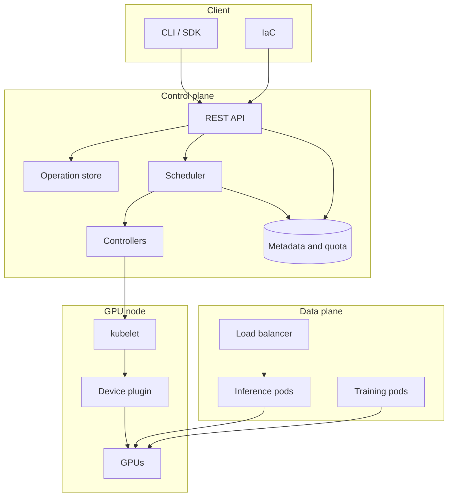

# GPU and Cloud Systems Design Questions

Short, interview-shaped design questions for GPU cloud roles. Each one carries a
diagram, the reasoning a strong answer follows, and the follow-ups that decide
whether the answer was deep or just fast.

No code in this folder. This is the whiteboard half of the loop.

## How to use this

1. Read a question. Close the file. Say the answer out loud for five minutes.
2. Reopen it and compare against the diagram and the numbered reasoning.
3. If the follow-ups feel uncomfortable, that is the part to study.

## The questions

| # | Question | Theme | File |
|---|---|---|---|
| 1 | Why is a GPU fast at matmul and slow at a parser? | Execution model | [01](01-gpu-execution-model.md) |
| 2 | The job is "GPU bound" at 30% utilization. Where is the time? | Data movement | [01](01-gpu-execution-model.md) |
| 3 | Design a scheduler for 1000 GPU nodes | Scheduling | [02](02-gpu-cluster-scheduling.md) |
| 4 | Two teams share a GPU pool and one starves the other | Fairness | [02](02-gpu-cluster-scheduling.md) |
| 5 | A GPU falls off the bus mid-job | Failure handling | [03](03-gpu-cloud-control-plane.md) |
| 6 | Design the API to launch a GPU workload | Control plane | [03](03-gpu-cloud-control-plane.md) |
| 7 | Design a multi-tenant inference path | Serving | [04](04-serving-and-artifacts.md) |
| 8 | Distribute a 100 GB model to 500 nodes | Artifact delivery | [04](04-serving-and-artifacts.md) |
| 9 | Who used which GPU, and what did it cost? | Metering | [05](05-operations-and-cost.md) |
| 10 | "My job got slower" | Debugging | [05](05-operations-and-cost.md) |

## The stack you are designing

## Four facts that shape every answer

Most GPU cloud design questions reduce to these. State them early and the rest
of the answer organizes itself.

1. **A GPU is an integer, not a fraction.** Kubernetes extended resources are
   whole numbers with request equal to limit. Splitting one GPU means either
   MIG (a real hardware partition) or time-slicing (a cooperative lie).
2. **A GPU cannot be preempted cheaply.** Context switches cost milliseconds and
   video memory. Preemption is a drain, not a pause.
3. **A GPU is useless without data beside it.** Every design question eventually
   becomes a data movement question: PCIe, NVLink, InfiniBand, or a cache.
4. **GPUs are not interchangeable.** Type, memory size, and interconnect decide
   whether a job runs well. Placement is part of correctness, not tuning.

## Reading order

If you only have an hour: **1, 3, 6, 10**. Those are the four that get asked the
most and cover the widest surface.
