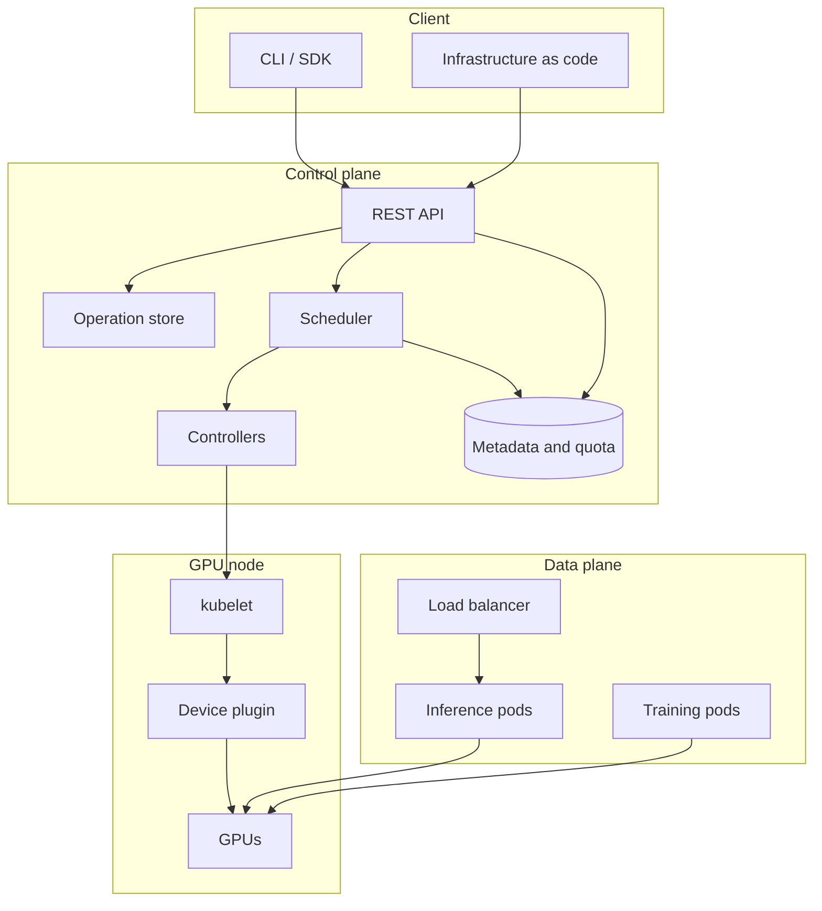

# GPU and Cloud Systems Design

This document is a reference on the design of GPU-backed cloud services. It
covers the GPU execution model and the way that model constrains system
architecture, the mechanisms by which GPU capacity is scheduled and shared, the
design of the control plane and its client libraries, the data path used for
inference serving, and the distribution of model artifacts to the machines that
serve them. A final section covers metering and the diagnosis of performance
regressions.

The material is organized by design topic. Each topic presents the background
required to reason about it, a design, and the associated tradeoffs and failure
modes. Diagrams are written in Mermaid and render on GitHub.

## Contents

| Section | Topic | File |
|---|---|---|
| 1 | GPU execution model and data movement | [01](01-gpu-execution-model.md) |
| 2 | Cluster scheduling and GPU sharing | [02](02-gpu-cluster-scheduling.md) |
| 3 | Control plane, API design, and failure handling | [03](03-gpu-cloud-control-plane.md) |
| 4 | Inference serving and model distribution | [04](04-serving-and-artifacts.md) |
| 5 | Operations: metering, audit, and diagnosis | [05](05-operations-and-cost.md) |

## System overview

### Layer responsibilities

| Layer | Responsibility | Principal concerns |
|---|---|---|
| Client | Express intent and hide transport details | Retries, pagination, credential handling, configuration precedence |
| Control plane | Validate, persist, place, and track work | Idempotency, asynchronous operations, quota, audit |
| Data plane | Execute workloads and serve traffic | Batching, autoscaling, isolation, cold start |
| Node | Expose and assign physical devices | Health reporting, device allocation, topology |

## Characteristics of GPU resources

Four properties of GPU hardware influence most design decisions in this domain,
and most design disagreements resolve once they are stated explicitly.

### Allocation granularity

GPU capacity is represented in Kubernetes as an extended resource, which is
specified in whole units and requires that the request equal the limit.
Allocating less than a complete device therefore requires either a hardware
partition, such as MIG, or a cooperative sharing mechanism, such as time slicing
or MPS. These mechanisms differ substantially in the isolation they provide, and
the choice between them has consequences for accounting as well as for
performance.

### Preemption cost

Device state cannot be saved and restored cheaply. Preemption is therefore
implemented by stopping and later restarting a workload rather than by suspending
and resuming it. This affects the design of scheduling queues, and it makes the
frequency of checkpointing a scheduling parameter as well as a reliability one.

### Data movement

Device memory bandwidth is high, host transfer bandwidth over PCIe is roughly an
order of magnitude lower, and inter-node interconnect bandwidth is lower again.
Any design that moves data frequently has a data movement problem irrespective of
how the compute is written.

### Heterogeneity

Device generation, memory capacity, and interconnect configuration determine what
a workload can run and how well it scales. Placement therefore affects whether a
workload runs correctly and efficiently, and cannot be treated solely as a
tuning consideration.

## Conventions

- Figures for latency and bandwidth are order-of-magnitude values intended for
  reasoning about which term dominates. They are not suitable for capacity
  planning.
- "Node" refers to a machine that hosts GPUs. "Device" refers to a single GPU.
- Descriptions of Kubernetes behavior refer to upstream semantics for the
  current stable release.
