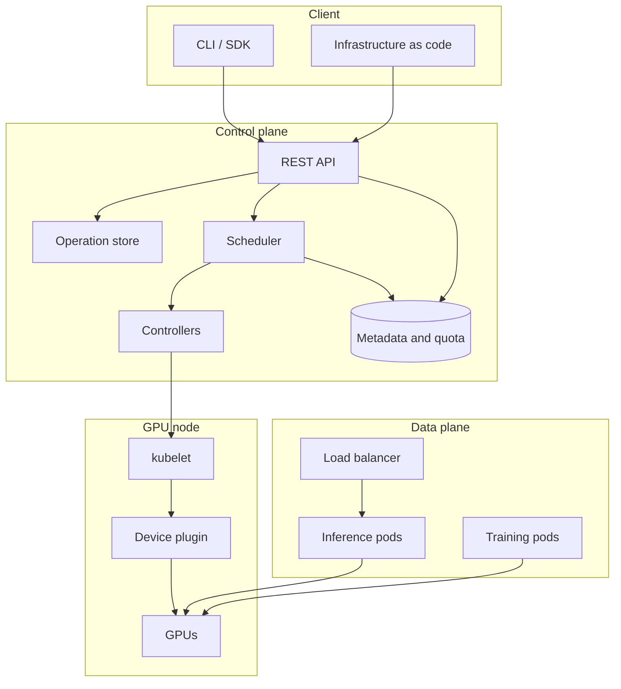

# GPU and Cloud Systems Design

A design reference for building GPU-backed cloud services. It covers the GPU
execution model that motivates the architecture, how GPUs are scheduled and
shared, how workloads are submitted and observed, how models reach the machines
that serve them, and how the system behaves when hardware fails.

The material is organized as a set of design topics. Each topic states the
scenario, gives the background needed to reason about it, presents a design, and
records the tradeoffs and failure modes. Diagrams are Mermaid and render
directly on GitHub.

## Contents

| Section | Topic | File |
|---|---|---|
| 1 | GPU execution model and data movement | [01](01-gpu-execution-model.md) |
| 2 | Cluster scheduling and GPU sharing | [02](02-gpu-cluster-scheduling.md) |
| 3 | Control plane, API design, and failure handling | [03](03-gpu-cloud-control-plane.md) |
| 4 | Inference serving and model distribution | [04](04-serving-and-artifacts.md) |
| 5 | Operations: metering, audit, and diagnosis | [05](05-operations-and-cost.md) |

## System overview

### Layer responsibilities

| Layer | Responsibility | Key concerns |
|---|---|---|
| Client | Express intent, hide transport details | Retries, pagination, credential handling, config precedence |
| Control plane | Validate, persist, place, and track work | Idempotency, asynchronous operations, quota, audit |
| Data plane | Run the workload and serve traffic | Batching, autoscaling, isolation, cold start |
| Node | Expose and assign physical devices | Health reporting, device allocation, topology |

## Constraints that shape most decisions

Four properties of GPUs drive the architecture more than anything else. Most
design disagreements resolve once these are stated explicitly.

**1. A GPU is a discrete, non-divisible resource in the resource model.**
Kubernetes extended resources are integers, and the request must equal the limit.
Sub-device allocation requires either a hardware partition (MIG) or a cooperative
sharing mechanism (time slicing or MPS). These have very different isolation
properties and must be chosen deliberately.

**2. GPUs are expensive to preempt.** Saving and restoring device state costs
milliseconds and device memory. Preemption is implemented as a drain and restart
rather than a pause and resume, which affects how scheduling queues and
checkpointing are designed.

**3. Data movement dominates.** GPU memory bandwidth is very high, but host
transfer bandwidth over PCIe is roughly an order of magnitude lower, and
interconnect bandwidth between nodes is lower again. Any design that moves data
frequently has a data movement problem regardless of how the compute is written.

**4. GPUs are not interchangeable.** Device generation, memory capacity, and
interconnect determine what a workload can run and how well it scales. Placement
is a correctness concern, not a tuning detail.

## Conventions used in this document

- Latency and bandwidth figures are order-of-magnitude values for reasoning.
  Exact numbers vary by generation and interconnect.
- "Node" means a machine that hosts GPUs. "Device" means one GPU.
- Where Kubernetes behavior is described, it refers to upstream semantics for
  the current stable release.
